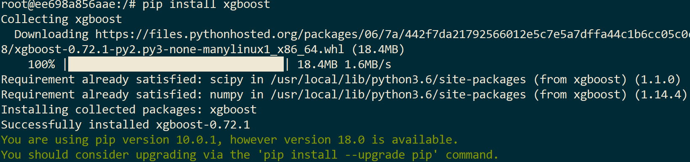
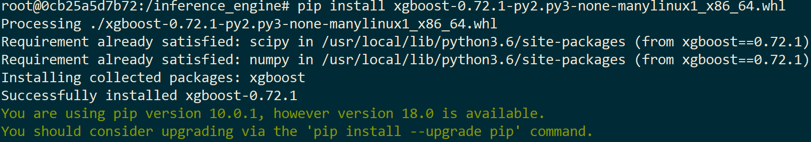

# Inference Engine Install Python Package


The **Inference Engine** is a Python runtime program that runs on Docker in a foggy device, so it is sometimes necessary to update the relevant suites that Python needs.

## Update the Python Package via the Internet

Example below is the installation of the xgboost Package:

1. Enter the container.
   ```
   docker exec -it $CONTAINER_ID bash
   ```

2. Execute pip install.
   ```
   pip install xgboost
   ```
   
    

## Update the Python Package via the whl file in a On-Premises environment

Example below is the installation of the xgboost Package:

1. Put the xgboost package whl file in the c:\inference_engine directory.


2. Go to the /inference_engine folder in the container that Docker runs.
   ```
   cd /inference_engine/
   ```
 
3. Use pip install to install xgboost's whl file.
   ```
   pip install xgboost-0.72.1-py2.py3-none-manylinux1_x86_64.whl
   ```
   
