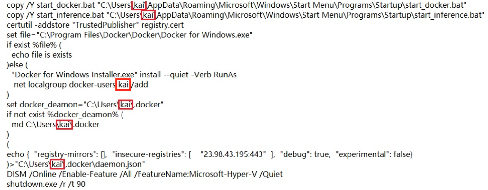
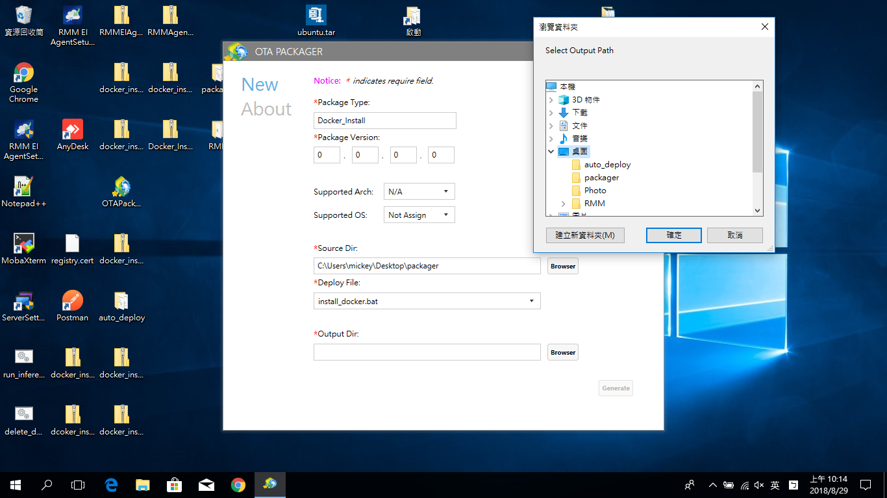
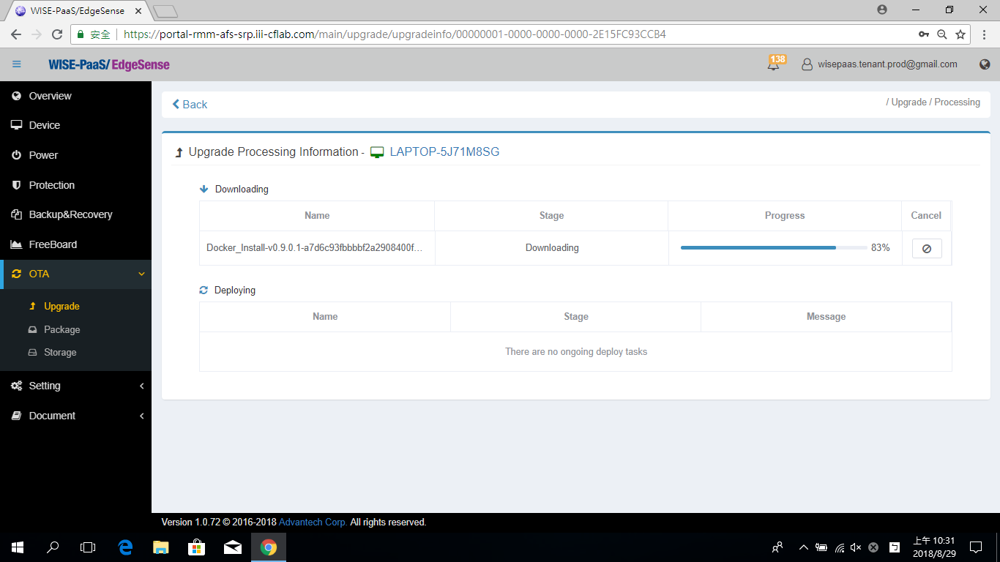
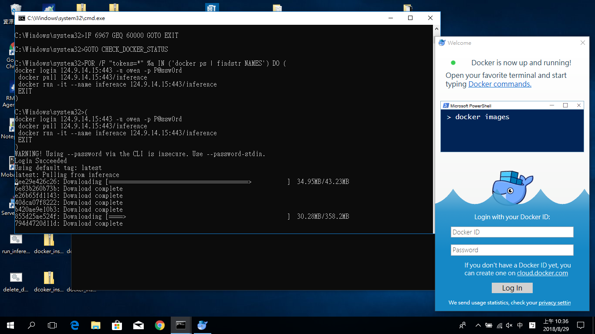
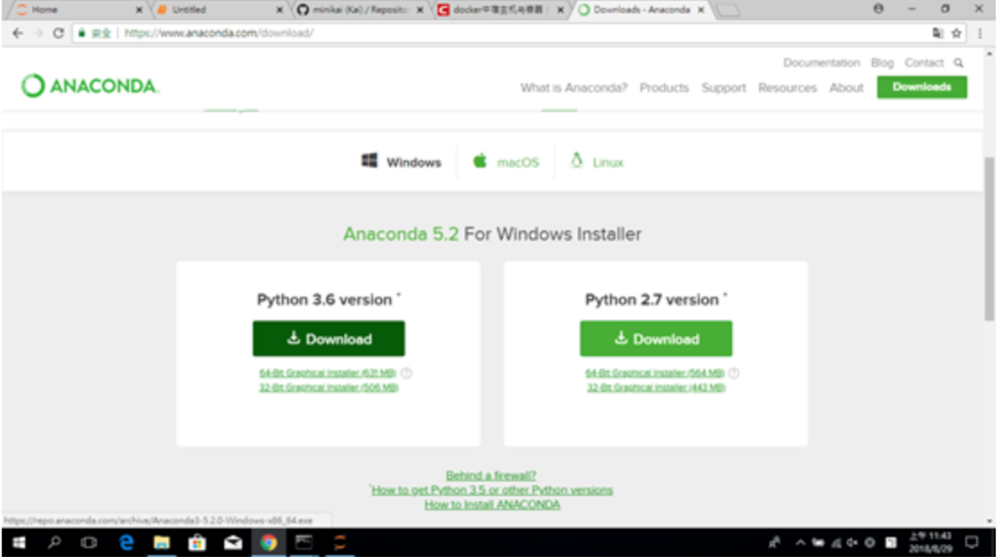
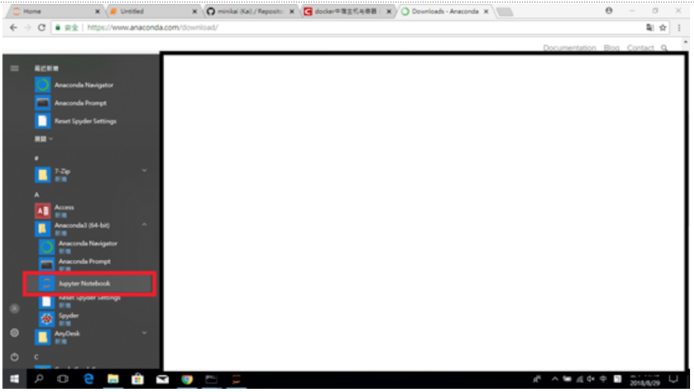
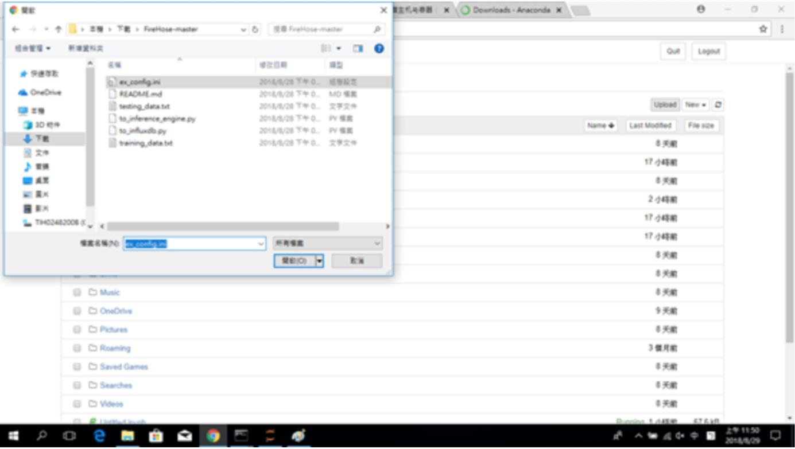
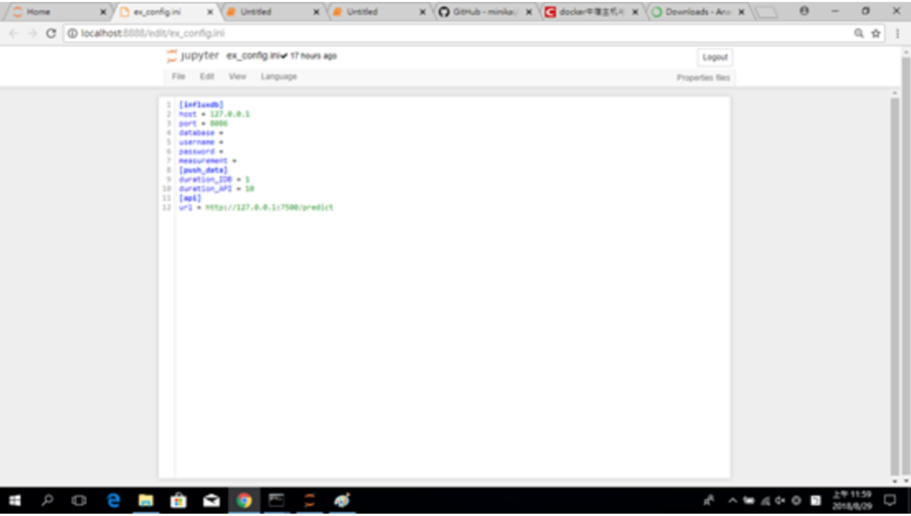
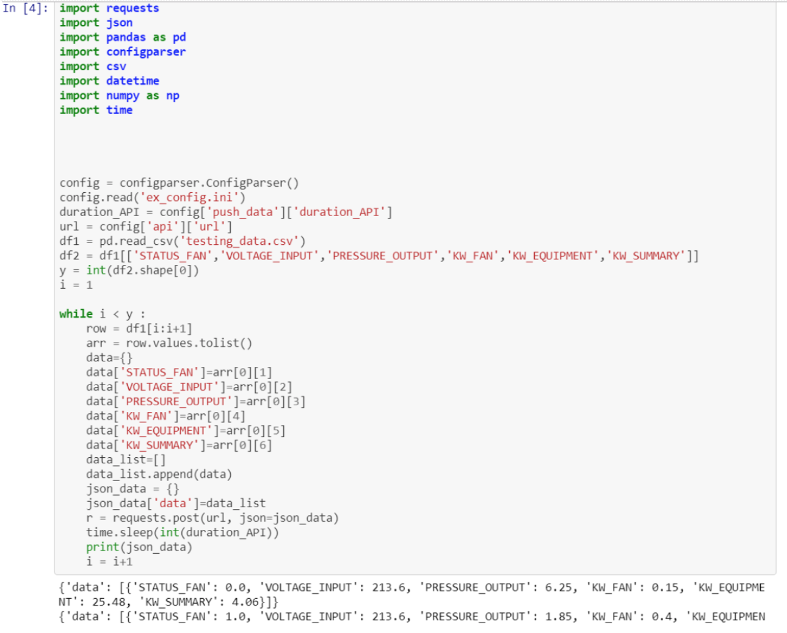

# Inference Engine Install Automatically in Edge Device

Previously, an introduction of **Inference Engine**, it's a Python runtime program on Docker. We can install it manually step by step. However, for the industial application, there are many edge devices (e.g., perhaps 100, 1000, or more devices) work online at the same time. In the section, we introduce how to install the Inference Engine automatically in many edge devices.

#### Pre-condition
* The OS of edge devices must be the **Windows 10 Pro** 64-bit version, and **Build 14393 or later**.

* The language of OS must be in **Simplified Chinese**, **Traditional Chinese**, and **English**.

* Turn on the Hyper-V in Windows 10. About the steps, please refer the [document](https://docs.microsoft.com/zh-tw/virtualization/hyper-v-on-windows/quick-start/enable-hyper-v).

* The edge devices must be installed the **RMM Agent (v-1.0.16)**, and registed in RMM Server.

* Get the application of packaging (OTAPackager-1.0.5.exe). [[Download](http://advgitlab.eastasia.cloudapp.azure.com/EI-PaaS-SampleCode/analytics_framework_service/blob/master/inference_engine/auto_install_docker/OTAPackager-1.0.5.exe.zip)]

* Download the files for package as follows: 
   
   * Docker installer. [[Download](https://store.docker.com/editions/community/docker-ce-desktop-windows)]

   * Three .bat files (include install_docker.bat, start_docker.bat, start_inference.bat). [[Download](http://advgitlab.eastasia.cloudapp.azure.com/EI-PaaS-SampleCode/analytics_framework_service/tree/master/inference_engine/auto_install_docker)]

   * SSL credential (registry.cert). [[Download](http://advgitlab.eastasia.cloudapp.azure.com/EI-PaaS-SampleCode/analytics_framework_service/tree/master/inference_engine/auto_install_docker)]

* Setup for login automatically after rebooting, please refer the [page](https://www.intowindows.com/how-to-automatically-login-in-windows-10/).

* Close the firewall.
	* Control Panel > System and Security > Windows Defender FireWall > Customize Settings.
	* Turn off Windows Defender Firewall.
	

* Close the notification.
	* Control Panel > System and Security > Security and Maintenance > Change User Account Control settings.
	* Set "Never notify".
	

* The docker offical suggestion before installing, please refer the [docker docs](https://docs.docker.com/docker-for-windows/install/#what-to-know-before-you-install).
	* Windows 10 64bit: Pro, Enterprise or Education (1607 Anniversary Update, Build 14393 or later).

	* Virtualization is enabled in BIOS. Typically, virtualization is enabled by default. This is different from having Hyper-V enabled. For more detail see Virtualization must be enabled in Troubleshooting.
	
	* CPU SLAT-capable feature.

	* At least 4GB of RAM.

## Start to Install Inference Engine

1. Use the OTApackager APP to package the required files.
	
	a. The required files.
	

	b. Edit "install_docker.bat", the file path should be modified to matching the path in the edge device.
	

	c. Enter the Package Tyep, Package Version, then select the path for saving the package file.
	

    d. Select **install_docker.bat** to be the "Deploy File".
    

    e. Select the folder for saving the package file.
    

2. Login to **RMM Portal**, and upload the package file.
	
	a. Login to **RMM Portal**.
	

	b. Click OTA Package.
	

	c. Click "Upload".
	

	d. Select the package file for uploading.
	

	e. Wait a second, when the progress bar goes to 100%, the uploaded file is shown in the list.
	

3. Send the uploaded file to the edge device for installing automatically.
	
	a. Click "OTA" and "Upgrade". Then, select the device to be installed.
	

	b. Selcet the package which want to **Upgrade**.
	

	c. When the progressing bar goes to 100%, the edge device downloaded the package file completely, and start to install it.
	

4. Before installing the package, the edge device restart once. The **Docker** in the edge device starts automatically, and the inference engine runs.

	a. The screenshot shows when the installation is running.
	

	b. In the screenshot, it shows the required images are downloading.
	

Finally, an edge device has been installed the inference engine automatically. Therefore, if there are many edge devices need to install the inference engine, we just need pick mutiple devices in **Step 3.**, and they will be installed completely.

Now, we can use the model which is trained in Scenario 2. to inference.
a. Confirm that the model is trained successfully in Scenario 2., and devivered to edge device by OTA.
b. Download the anaconda (with python 3.6), and install it in the edge device. [[Download](https://www.anaconda.com/download/)]
	
c. Start the **Jupyter Notebook** from application.
	
d. Download the [firehose](https://github.com/minikai/to_inference_engine_firehose_demo_0904) for testing the inference engine.
	
e. Click the Upload button at the top right to upload ex_config.ini, firehose.ipynb, and testing_data.csv to jupyter.
	
f. Click and modify ex_config.ini, and add "http://127.0.0.1:7500/predict" after "url=". Then, save the file.
	
g. Open the firehose.ipynb just uploaded on jupyter and click `Run` to execute.
	
h. Login to inference_engine, and see the prediction results.   
	  i. Execute $ cmd to open the command window   
	 ii. Execute $ docker exec -it inference bash   
	iii. In order to check the model is delivered into the inference engine, we can execute $ ls /root/inference_engine/inference_engine/ to see the model.pkl exists or not. (About the model name, it's must named by "model.pkl".)   
	 iv. Execute $ cat /root/inference_engine/inference_engine/predict_result.txt to check if the predicted value continues to increase, if the representative is successful.   
	
