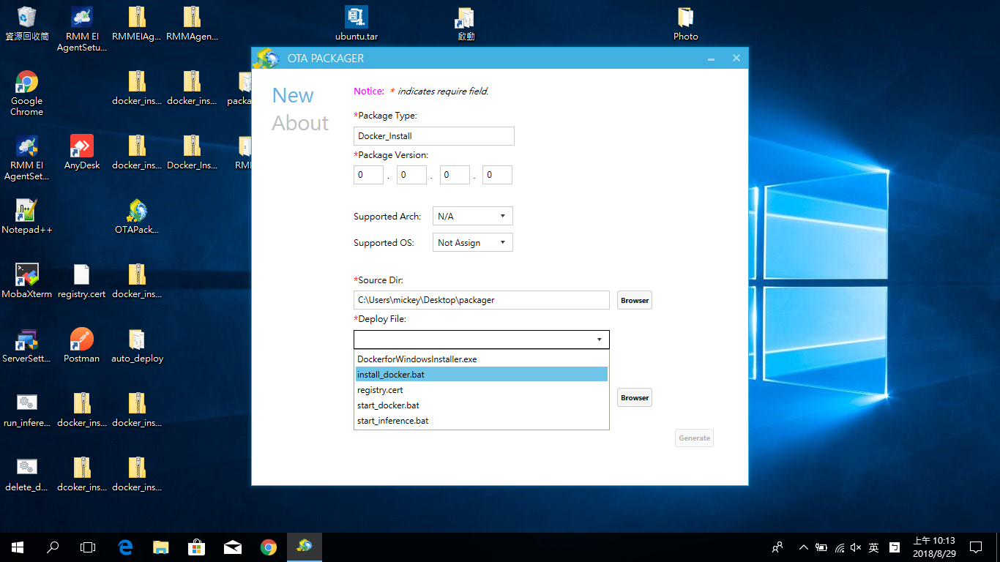
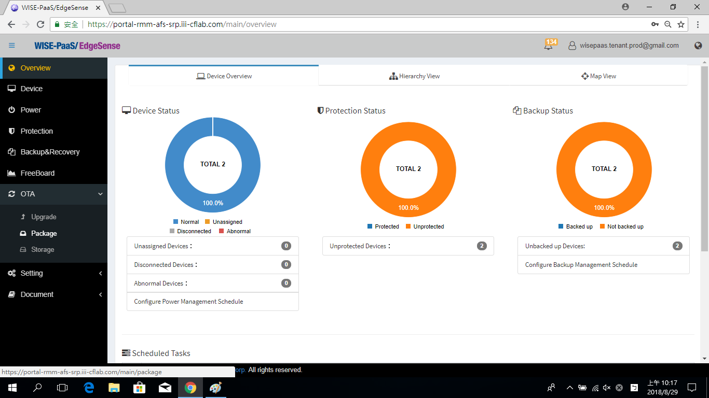
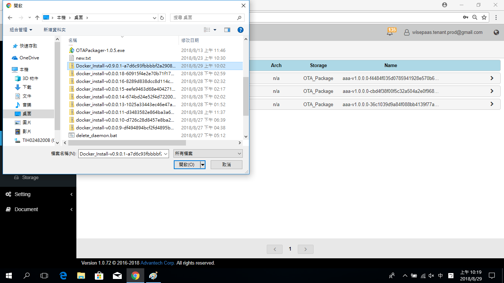
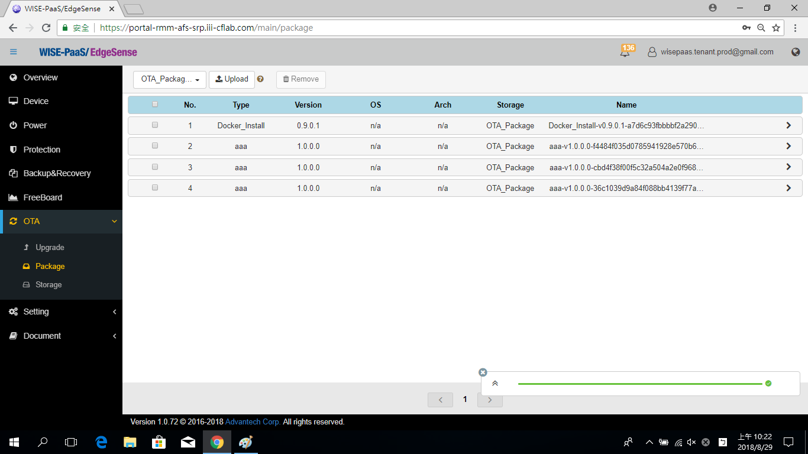
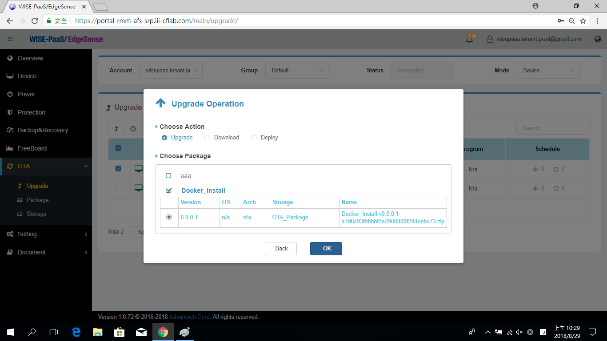
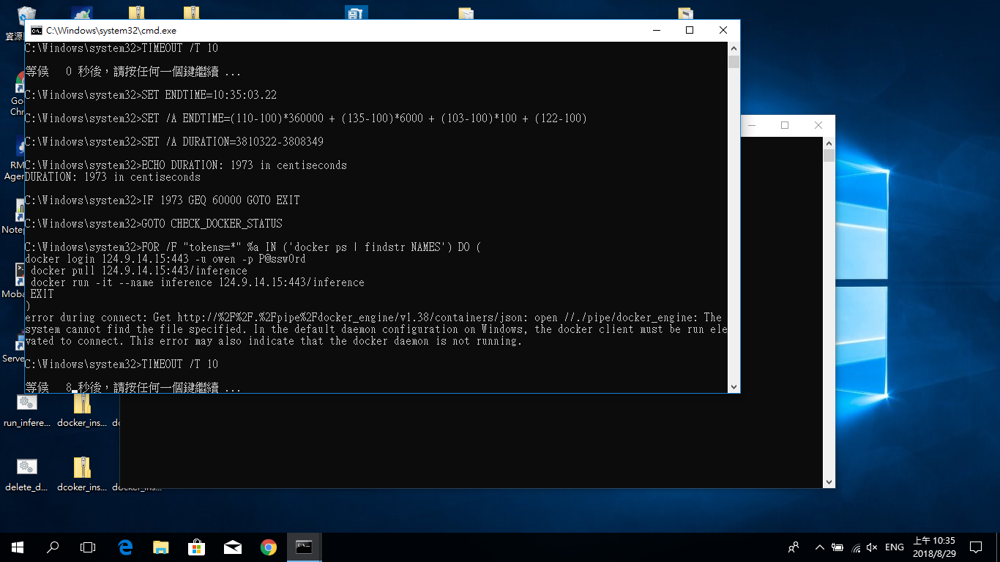

# Inference Engine Install Automatically in Edge Device

Previously, an introduction of **Inference Engine**, it's a Python runtime program on Docker. We can install it manually step by step. However, for the industial application, there are many edge devices (e.g., perhaps 10, 100, or 1000 devices) work online at the same time. In the section, we introduce how to install the Inference Engine automatically in many edge devices.

## Pre-condition
* The OS of edge devices must be the **Windows 10 Pro** or higher version.
* The edge devices must be installed the **RMM Agent (v-1.0.16)**, and registed in RMM Server.
* Get the application of packaging (OTAPackager-1.0.5.exe).
* Download the files for package as follows: 
   * Docker installer. ([Download](https://store.docker.com/editions/community/docker-ce-desktop-windows))

   * Three .bat files (include install_docker.bat, start_docker.bat, start_inference.bat). [download](http://advgitlab.eastasia.cloudapp.azure.com/EI-PaaS-SampleCode/analytics_framework_service/tree/master/inference_engine/auto_install_docker)

   * SSL credential (registry.cert). [download](http://advgitlab.eastasia.cloudapp.azure.com/EI-PaaS-SampleCode/analytics_framework_service/tree/master/inference_engine/auto_install_docker)
* Setup for login automatically after rebooting, please refer the [link](http://z88487561.pixnet.net/blog/post/47069245-%5Bwindows%5D-win-10-%E9%96%8B%E6%A9%9F-%E5%85%8D%E5%AF%86%E7%A2%BC-%E8%87%AA%E5%8B%95%E7%99%BB%E5%85%A5-%E5%B0%8F%E6%8A%80%E5%B7%A7).

## Start to Install Inference Engine

