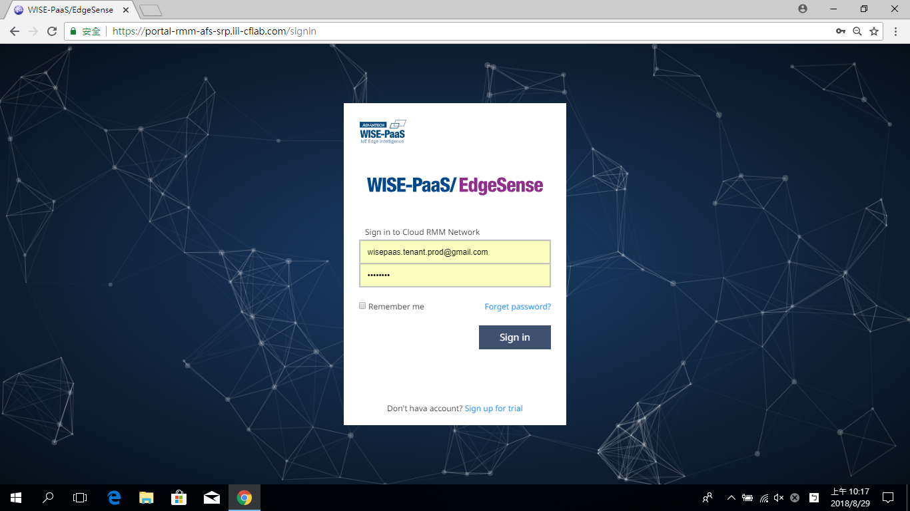
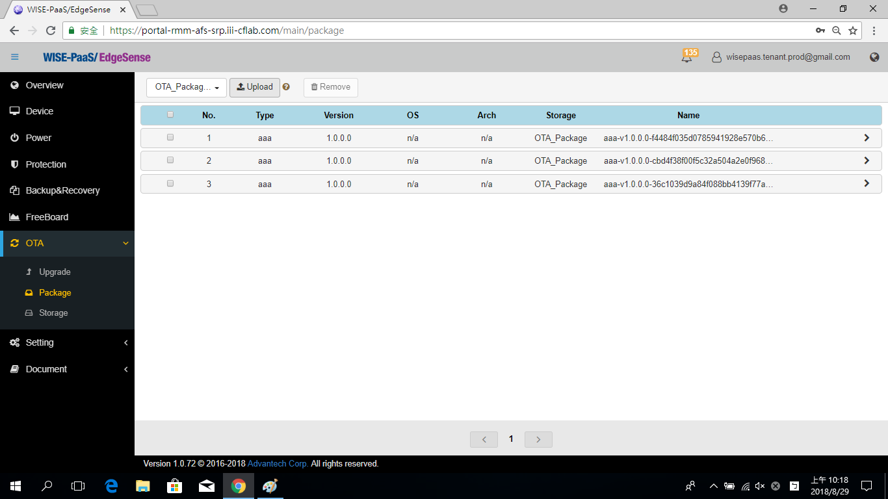

# Inference Engine Install Automatically in Edge Device

Previously, a introduction of **Inference Engine**, it's a Python runtime program on Docker. We can install it manually step by step. However, for the industial application, there are many edge devices (e.g., perhapes 10, 100, or 1000 devices) work online at the same time. In the section, we introduce how to install the Inference Engine automatically in many edge devices.

## Pre-condition
* The OS of edge devices must be the **Windows 10 Pro** or higher version.
* The edge devices must be installed the **RMM Agent (v-1.0.16)**, and registed in RMM Server.
    

## Update the Python Package via the whl file in a On-Premises environment

