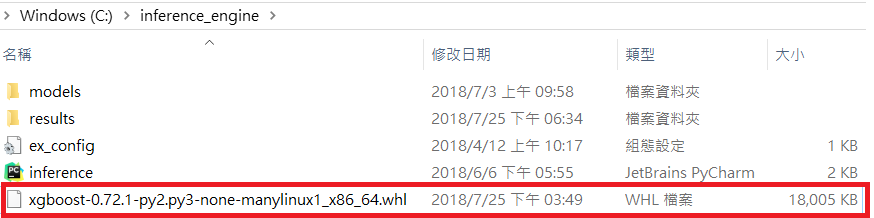
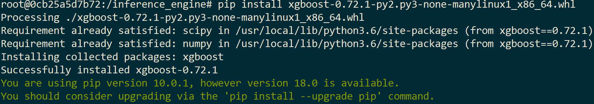

# Inference Engine Install Automatically in Edge Device


The Inference engine is a Python runtime program that runs on Docker a foggy device, so it is sometimes necessary to update the relevant suites that Python needs.

## Pre-condition


   
    

## Update the Python Package via the whl file in a On-Premises environment


   


1. Put the xgboost package whl file in the c:\inference_engine directory.


2. Go to the /inference_engine folder in the container that Docker runs.
   ```
   cd /inference_engine/
   ```
 
3. Use pip install to install xgboost's whl file.
   ```
   pip install xgboost-0.72.1-py2.py3-none-manylinux1_x86_64.whl
   ```
   
