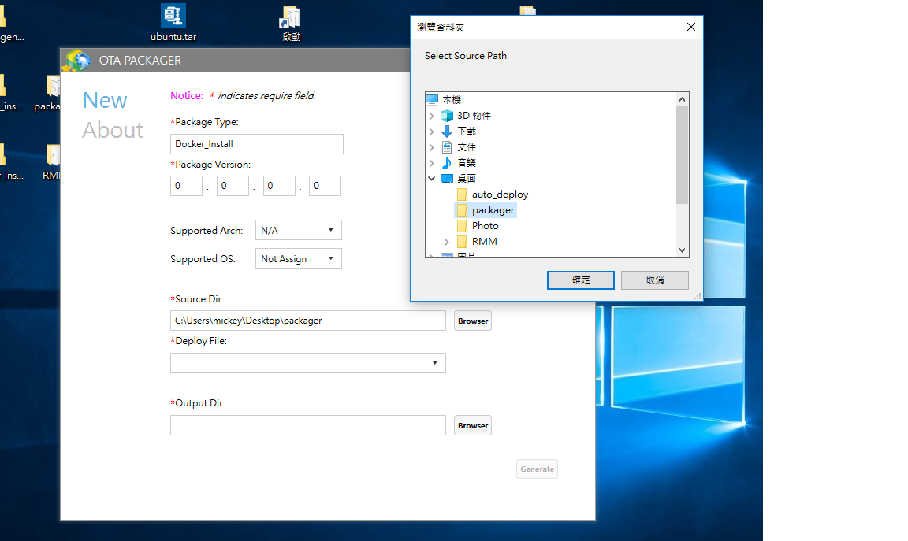
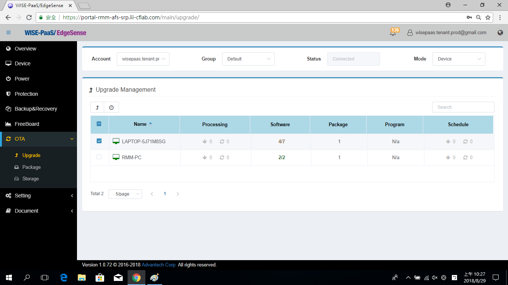

# Inference Engine Install Automatically in Edge Device

Previously, an introduction of **Inference Engine**, it's a Python runtime program on Docker. We can install it manually step by step. However, for the industial application, there are many edge devices (e.g., perhaps 100, 1000, or more devices) work online at the same time. In the section, we introduce how to install the Inference Engine automatically in many edge devices.

## Pre-condition
* The OS of edge devices must be the **Windows 10 Pro** or higher version.
* The edge devices must be installed the **RMM Agent (v-1.0.16)**, and registed in RMM Server.
* Get the application of packaging (OTAPackager-1.0.5.exe).
* Download the files for package as follows: 
   * Docker installer. [[Download](https://store.docker.com/editions/community/docker-ce-desktop-windows)]

   * Three .bat files (include install_docker.bat, start_docker.bat, start_inference.bat). [[Download](http://advgitlab.eastasia.cloudapp.azure.com/EI-PaaS-SampleCode/analytics_framework_service/tree/master/inference_engine/auto_install_docker)]

   * SSL credential (registry.cert). [[Download](http://advgitlab.eastasia.cloudapp.azure.com/EI-PaaS-SampleCode/analytics_framework_service/tree/master/inference_engine/auto_install_docker)]
* Setup for login automatically after rebooting, please refer the [link](http://z88487561.pixnet.net/blog/post/47069245-%5Bwindows%5D-win-10-%E9%96%8B%E6%A9%9F-%E5%85%8D%E5%AF%86%E7%A2%BC-%E8%87%AA%E5%8B%95%E7%99%BB%E5%85%A5-%E5%B0%8F%E6%8A%80%E5%B7%A7).

## Start to Install Inference Engine

1. Use the OTApackager APP to package the required files.
	
	a. The required files.
	

	b. Edit "install_docker.bat", the file path should be modified to matching the path in the edge device.
	

	c. Enter the Package Tyep, Package Version, then select the path for saving the package file.
    

    d. Select **install_docker.bat** to be the "Deploy File".
    

    e. Select the folder for saving the package file.
	

2. Login to **RMM Portal**, and upload the package file.
	
	a. Login to **RMM Portal**.
	

	b. Click OTA Package.
	

	c. Click "Upload".
	

	d. Select the package file for uploading.
	

	e. Wait a second, when the progress goes to 100%, the uploaded file is shown in the list.
	

3. Send the uploaded file to the edge device for installing automatically.
	
	a. Click "OTA", then click "Upgrade".
	

	

	

	

