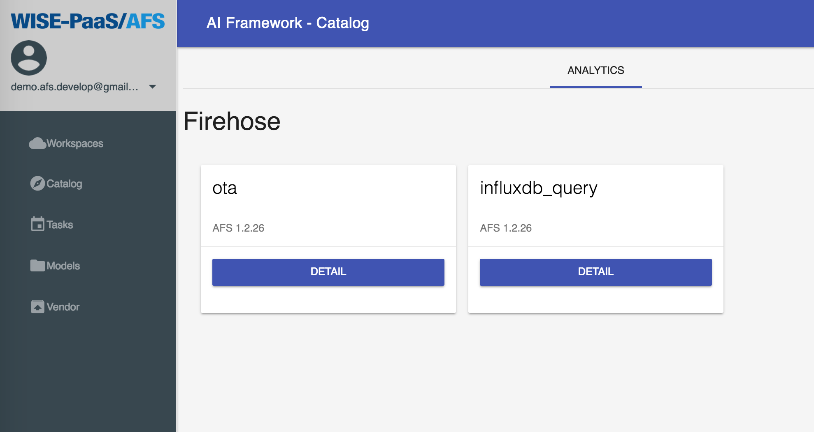

## Catalog
In **AFS**, we provide the analytic methods and tools in **Catalog**. The users can subscribe the methods and use them in **Workspaces**. When creating a **Solution** in **Workspaces**, there are two nodes, ota and influxdb_query, we must subscribe them then develop the new solution. More about creating new **Solution**, please refer [Solution](workspace#Solution).

