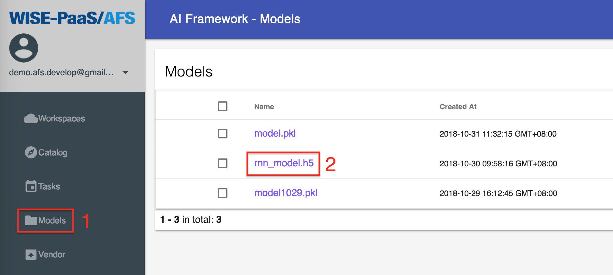
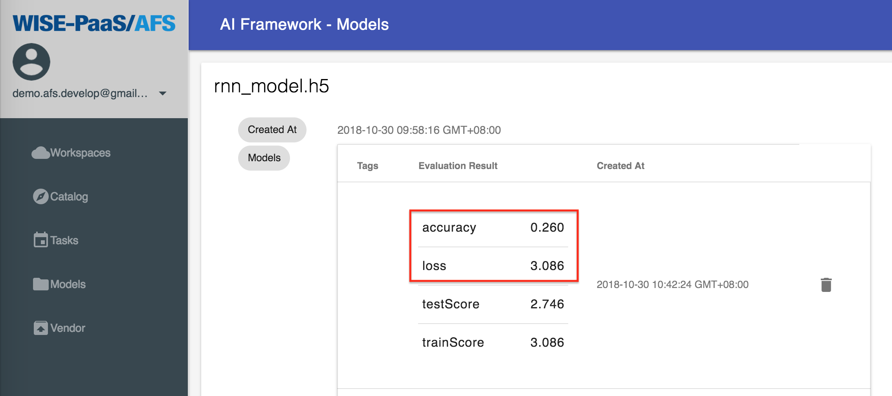

## Models
After implementing the training APP, you can go to AFS Models. Select Repository of the model and read the performance value of the training result. The steps are as below:

1. Select the training APP after clicking Models.

2. The latest training time and performance value can be inquired.

### Create new model repository
When the model is trained, the new model repository is created automatically.
About training model, please refer [Example of Online Code IDE](https://afs-docs.readthedocs.io/en/latest/portal/workspace.html#example-of-online-code-ide).

### Model repository detail
Click the model to see the performance value of training result.

