## SCENARIO 1. AFS Workspaces - Analytics
#### Pre-condition of Analytics
1. Use SSO Tenant/Developer to login Management Portal, and subscribe the InfluxDB service instance. (Please refer [Management Portal User Manual](https://portal-technical-stage.wise-paas.com/doc/document-portal.html#ManagementPortal-1).)

	a. Subscribe the service and name influxdb_dt.
	
	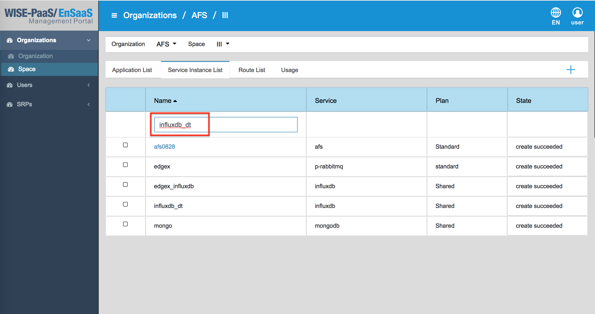

	b. Create the "Service Key", and get the connecting information of InfluxDB (database, host, password, etc.).
	
	
	

2. Subscribe the AFS service instance from Management Portal, and it's named by afs_training. When it shows **create succeeded**, the AFS service instance is created.

3. Click **afs_training** to enter the AFS.
	

4. Create a new Analytics, Firehose, to upload the training data to database.
	
	a. Create a new Analytics, and it's named by "data_to_influxdb".
		
		

	b. Copy the [sample code](http://advgitlab.eastasia.cloudapp.azure.com/EI-PaaS-SampleCode/analytics_framework_service/blob/master/notebook/02_support_vector_machine/data_to_influxdb-dev.md) to the data_to_influxdb, and the code must be divided by cell.

	**Note:** The **Cell** is defined as follows:
	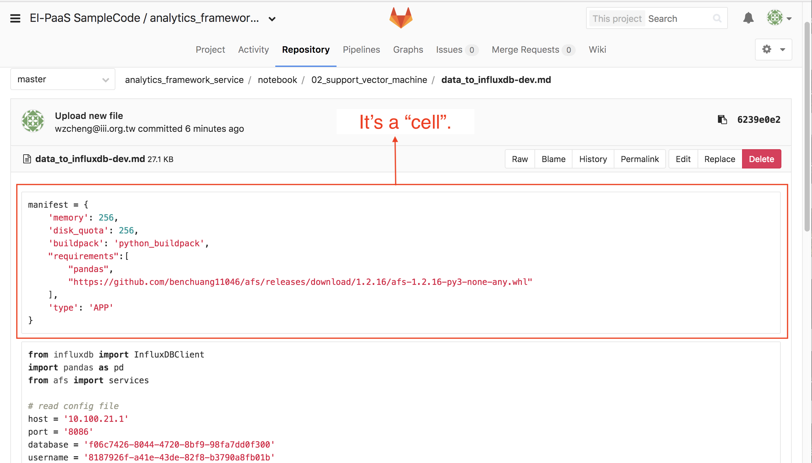
	
	c. Enter the connecting information to the data_to_influxdb.
	
	

	d. Execute each cell.

	e. Click the icon in the left side to save it, and click `SAVE` to upload the Analytics App.
	

	f. Wait a minute, the status of the Analytic will change to **Running**, and go to next step.
	

#### Create Analytics by Online Code IDE
1. Create a new Analytics, and it's named by rnn_model.
	
	

2. Copy the [sample code](http://advgitlab.eastasia.cloudapp.azure.com/EI-PaaS-SampleCode/analytics_framework_service/blob/master/notebook/02_support_vector_machine/rnn_model-dev.md) to rnn-model which is created in last step.

3. Install the scikit-learn package, please copy the command from the [link](http://advgitlab.eastasia.cloudapp.azure.com/EI-PaaS-SampleCode/analytics_framework_service/blob/master/notebook/02_support_vector_machine/install_package1), and paste the code in a new cell as the follows. After executing the cell, delete it.
	

	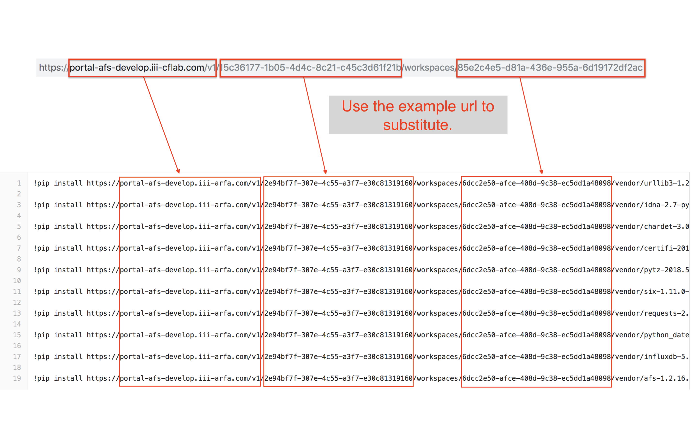

4. Enter the connecting information of InfluxDB.
	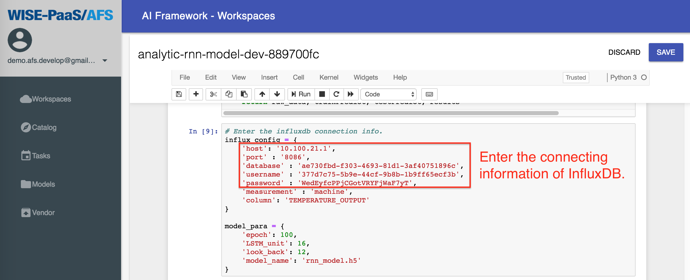

5. Execute all of cells.

6. Click the icon in the left side to save it, and click `SAVE` to upload the Analytics App.
	

7. Wait a minute, the status of the Analytics will change to **Running**, and go to next step.
	

8. Click **Models** in the menu, the model repository which is named by "rnn_model.h5" is created.
	

9. Click "rnn_model.h5", we can see the accurancy and loss of the trained model.
	


## SCENARIO 2. AFS Workspaces - Solutions
Create Online Flow IDE in the **AFS Workspaces - Solutions**, and train the **Desicion Tree** model. After training the model, use the OTA to deliver the model to the edge device.

#### Pre-condition of Solutions
1. Create the Decision Tree node in the Online Flow IDE.
	
	a. Create a new Aanlytic, and it's named by training_dt_model. About the detail process, please refer the Pre-condition Step 4.b in the Scenario 1.

	b. Copy the [sample code](http://advgitlab.eastasia.cloudapp.azure.com/EI-PaaS-SampleCode/analytics_framework_service/blob/master/notebook/02_support_vector_machine/training_dt_model-dev.md) to training_dt_model, and the code must be divided by cell.

	c. Pick the second cell, and click `Run` to execute it.
	

	d. Click the icon in the left side to save it, and click `SAVE` to upload the Analytics App.
	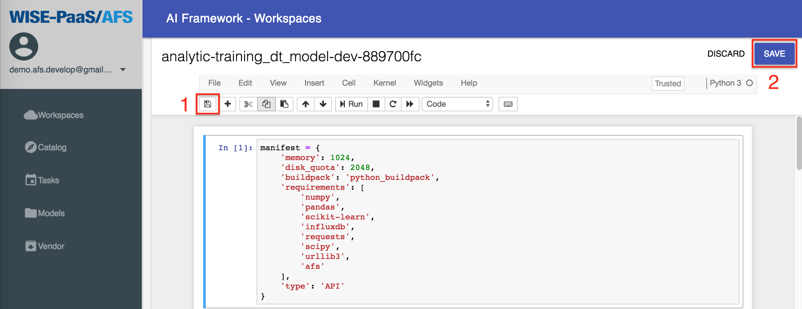

	e. Wait a minute, the status of the Analytics will change to **Running**, and go to next step.
	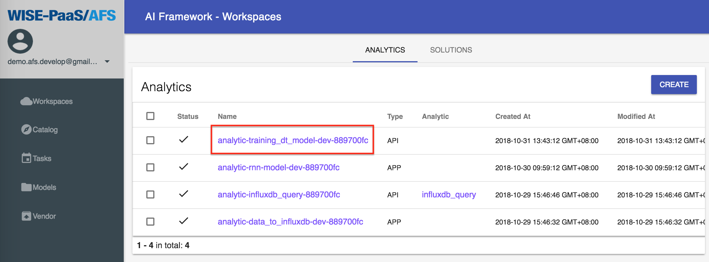

	**Note:** After the processing, the training_dt_model node is generated in the Online Flow IDE.

2. Subscribe the influxdb_query node in the Online Flow IDE.

	a. In the **Catalog**, we can subscribe the **influxdb_query** node in the Analytics category. Please refer the screeshots as follows:
	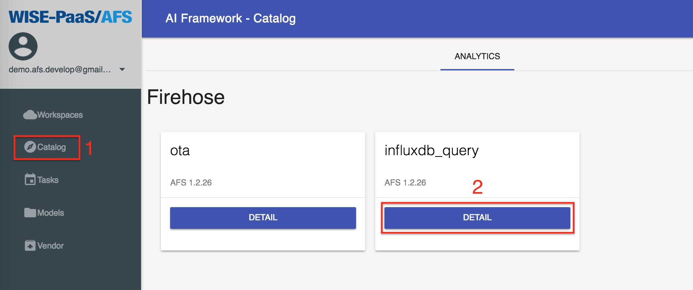
	

	b. The **influxdb_query** is shown in the **Analytics List** when it's subscribed successfully.

	c. Wait a minute, the status of the Analytics will change to **Running**, and go to next step.
	
	**Note:** After the processing, the influxdb_query node is generated in the Online Flow IDE.

3. Subscribe the OTA node in the Online Flow IDE.
	
	a. In the **Catalog**, we can subscribe the **ota** node in the Analytics category. Please refer the screeshots as follows:
	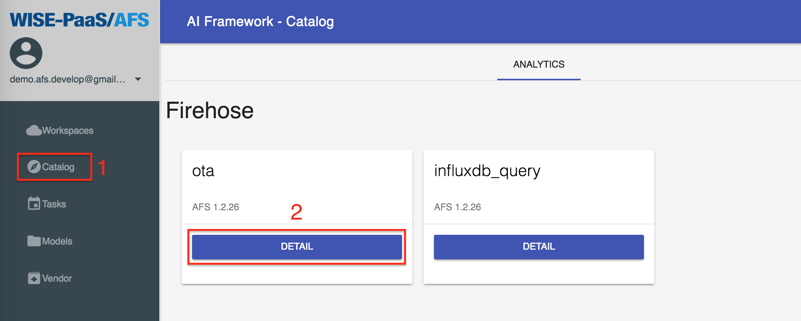
	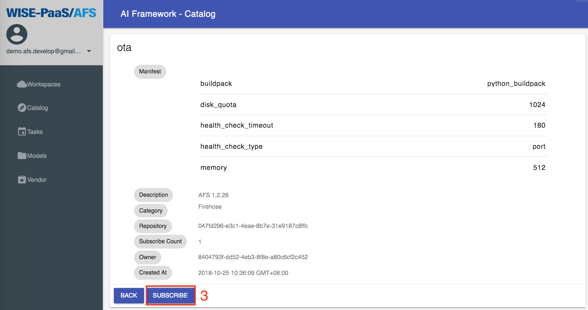

	b. The **OTA** is listed in the **Analytics** when it's subscribed successfully.
	
	c. Wait a minute, the status of the Analytics will change to **Running**, and go to next step.
	
	**Note:** After the processing, the OTA node is generated in the Online Flow IDE.

4. Setup the **RMM** device, include (1)install the **RMM Agent** in the edge device; (2)register the device; and (3)create a storage for RMM. Please refer the [document](https://portal-technical-stage.wise-paas.com/doc/document-portal.html#EdgeSense-4).

#### Create Solution by Online Flow IDE
1. Create a new Analytics, and it's named by training_decisiontree.
	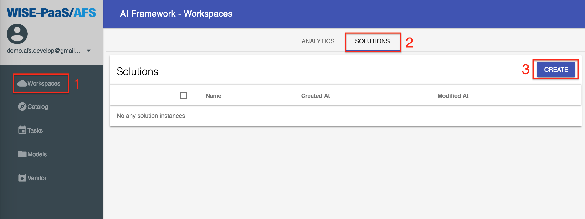
	
	
	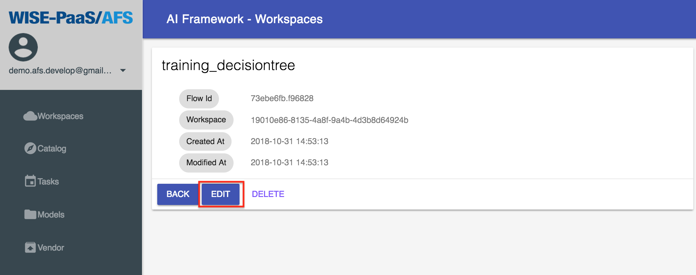

2. Pull the sso_setting node from the list in the left side. Then, enter the SSO Username and SSO Password
in it.

3. Pull the influxdb_query node from the list in the left side. Then, select the influxdb_dt and the service key that we have created. Therefore, enter `select * from machine` to the Query Command.
	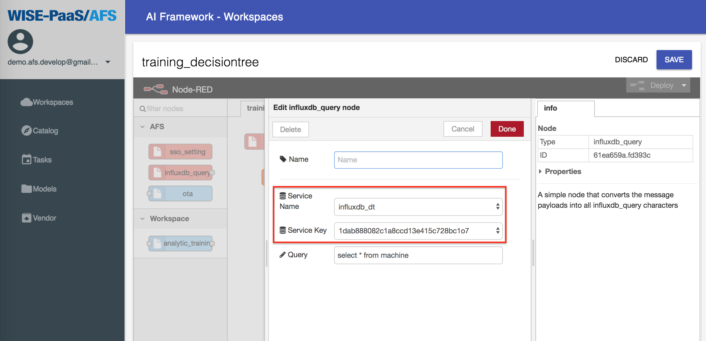

4. Pull the training_dt_model node from the list in the left side, and setup the parameters.
	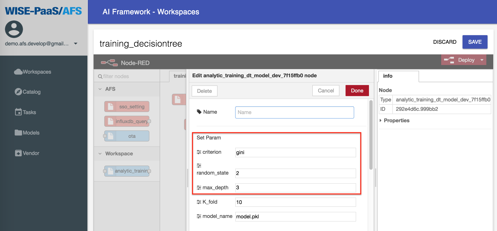

	* criterion: Can't be empty. Please enter *gini* or *entropy*, separated by commas, there must be no spaces between parameters and commas.
	
	* random_state and max_depth: Enter the integer only. If want to optimize the parameters, we can fill in multiple sets of parameters in the random_state and max_depth fields as shown above. The parameters must be separated by commas. There must be no blank between the parameters and the comma.
	
	* K_fold: Enter the times for cross validation, and it must be an interger and bigger than one.
	
	* model_name: Name the trained model, must .pkl type(e.g., model.pkl).
		
		
	
	* Select Features: Select which fields are to be put into the model for training (can be multiple select). In the field, please select the fields KW_EQUIPMENT, KW_FAN, KW_SUMMARY, PRESSURE_OUTPUT, STATUS_FAN, VOLTAGE_INPUT, and EVENT.
	
	* Select Numerical Features: Pick out the fields selected by select_features, which are the numeric fields (can be multiple selected but not fully selected, or not selected). Please select KW_EQUIPMENT, KW_FAN, KW_SUMMARY, PRESSURE_OUTPUT, STATUS_FAN, VOLTAGE_INPUT in the field.
	
	* Select Target Feature: Select the target of training. Please select EVENT in the field.
	
	* Map Column: The value of this field is the JSON Key value (can't be changed).

	
5. Pull the ota node from the list in the left side, and setup the parameters. Select the edge device and storage that were setuped in *Pre-condition*.
	

6. Connect the Influxdb_Firehose node to the training_dt_model node, then connect the training_dt_model node to the OTA node, click the `Deploy` button in the upper right corner, and click the `SAVE` button to save the Solution.
	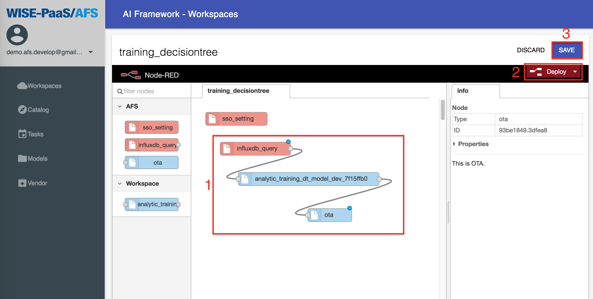

7. Create a new Solution Task.
	
	a. Click Tasks from the left menu, create a new task named training_decisiontree_task, and click the NEXT button.
	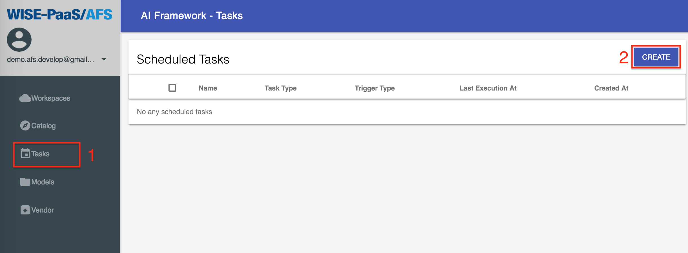
	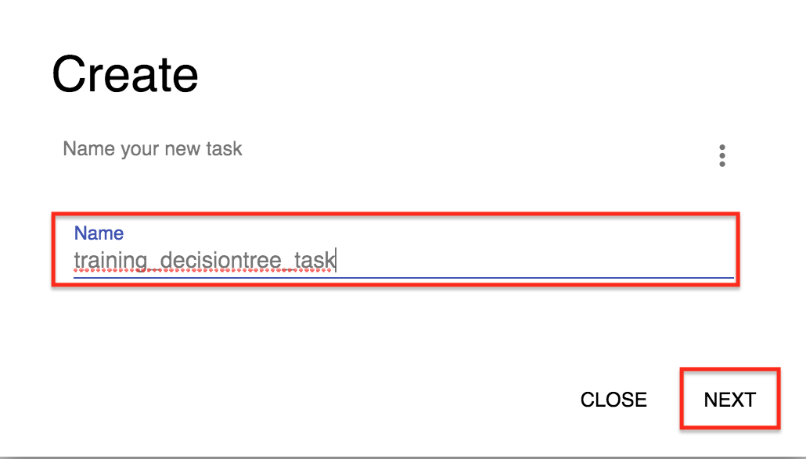

	b. Select the Solution Type, Solution Instance select training_decisiontree, and click NEXT.
	
	

	c. About the Trigger Type, select Interval, and selects Minutes in the Interval Type. The Interval fills in "1". Then, click CREATE.
	
	

8. Click training_decisiontree_task to enter the task to see the results.
	

9. Wait a minute, the task will start executing. After the execution is successful, the status will be displayed as succeeded. If it does not appear after 1 minute, please press f5 to refresh the page.
	

## SCENARIO 3. Inference Engine

#### Pre-condition
* The OS of edge devices must be the **Windows 10 Pro** or higher version.

* The edge devices must be installed the **RMM Agent (v-1.0.16)**, and registed in RMM Server.

* Get the application of packaging (OTAPackager-1.0.5.exe).

* Download the files for package as follows: 
   
   * Docker installer. [[Download](https://store.docker.com/editions/community/docker-ce-desktop-windows)]

   * Three .bat files (include install_docker.bat, start_docker.bat, start_inference.bat). [[Download](http://advgitlab.eastasia.cloudapp.azure.com/EI-PaaS-SampleCode/analytics_framework_service/tree/master/inference_engine/auto_install_docker)]

   * SSL credential (registry.cert). [[Download](http://advgitlab.eastasia.cloudapp.azure.com/EI-PaaS-SampleCode/analytics_framework_service/tree/master/inference_engine/auto_install_docker)]

* Setup for login automatically after rebooting, please refer the [page](https://www.intowindows.com/how-to-automatically-login-in-windows-10/).

#### Start to Install Inference Engine

1. Use the OTApackager APP to package the required files.
	
	a. The required files.
	

	b. Edit "install_docker.bat", the file path should be modified to matching the path in the edge device.
	

	c. Enter the Package Type, Package Version, then select the path for saving the package file.
	

    d. Select **install_docker.bat** to be the "Deploy File".
    

    e. Select the folder for saving the package file.
    

2. Login to **RMM Portal**, and upload the package file.
	
	a. Login to **RMM Portal**.
	

	b. Click OTA > Package.
	

	c. Click **Upload**.
	

	d. Select the package file for uploading.
	

	e. Wait a second, when the progress bar goes to 100%, the uploaded file is shown in the list.
	

3. Send the uploaded file to the edge device for installing automatically.
	
	a. Click OTA > Upgrade. Then, select the device to be installed.
	

	b. Selcet the package which want to **Upgrade**.
	

	c. When the progressing bar goes to 100%, the edge device downloaded the package file completely, and start to install it.
	

4. Before installing the package, the edge device restart once. The **Docker** in the edge device starts automatically, and the inference engine runs.

	a. The screenshot shows when the installation is running.
	

	b. In the screenshot, it shows the required images are downloading.
	

Finally, an edge device has been installed the inference engine automatically. Therefore, if there are many edge devices need to install the inference engine, we just need pick multiple devices in **Step 3.**, and they will be installed completely.

Now, we can use the model which is trained in Scenario 2. to inference.
	a. Confirm that the model is trained successfully in Scenario 2., and can be delivered to edge device by OTA.
	b. Download the anaconda (with python 3.6), and install it in the edge device. [[Download](https://www.anaconda.com/download/)]
		
	c. Start the **Jupyter Notebook** from application.
	
	d. Download the [firehose](https://github.com/minikai/to_inference_engine_firehose_demo_0904) for testing the inference engine.
	e. Click the Upload button at the top right to upload ex_config.ini, firehose.ipynb, and testing_data.csv to jupyter.
	
	f. Click and modify ex_config.ini, and add "http://127.0.0.1:7500/predict" after "url=". Then, save the file.
	
	g. Open the firehose.ipynb just uploaded on jupyter and click `Run` to execute.
	
	h. Login to inference_engine, and see the prediction results.		
		1. Execute ```$ cmd``` to open the command window.   		
		2. Execute ```$ docker exec -it inference bash```.   		
		3. To check if the model is normally dispatched into the inference engine, we can execute ```$ ls /root/inference_engine/inference_engine/``` to check the model.pkl exists or not.   	
		4. Execute ```$ cat /root/inference_engine/inference_engine/predict_result.txt``` to check if the predicted value continues to increase, if the representative is successful.		
		

## SCENARIO 4. AFS Vender
The development process can be done offline through Vendor.

1. The module can be installed offline through Vendor. About more details, please refer to [documents](https://afs-docs.readthedocs.io/en/latest/portal/workspace.html#install-module-with-vendor-in-private-cloud).

2. About how to manage the Vendor, including module upload, download, and delete the package, please refer to [documents](https://afs-docs.readthedocs.io/en/latest/portal/vendor.html).

## SCENARIO 5. AFS Task

#### Create a task
The deatil steps are included in Scenario 2., please refer to Step 8-10 of Scenario 2.

#### Create multiple tasks
1. Download “multiple_task_example.csv” to make the list of tasks.
	
	a. Click the CREATE button in the upper right corner of the Task page, click the button in the upper right corner of the pop-up window and click Create multiple task.

	b. Click the link to download csv example.

	c. Copy the [sample](http://advgitlab.eastasia.cloudapp.azure.com/EI-PaaS-SampleCode/analytics_framework_service/blob/master/notebook/02_support_vector_machine/multiple_task_example.csv) to a text editor and name the file multi_task.csv.

	Note: About the detail to edit the csv file, please refer to section 4.3 of the [spec document](https://docs.google.com/document/d/1FtTis-vThtgimmgG0DyWrc3X3V4_2L6OJrya5P5ipiw/edit).

2. Select the csv file (please select the csv file created by 1.c above) and click `CREATE` to create the tasks.

## SCENARIO 6. AFS Model
AFS Model shows the performance of the model training.
It has introduced in Step 8. to Step 9. of SCENARIO 1.


