## Tasks

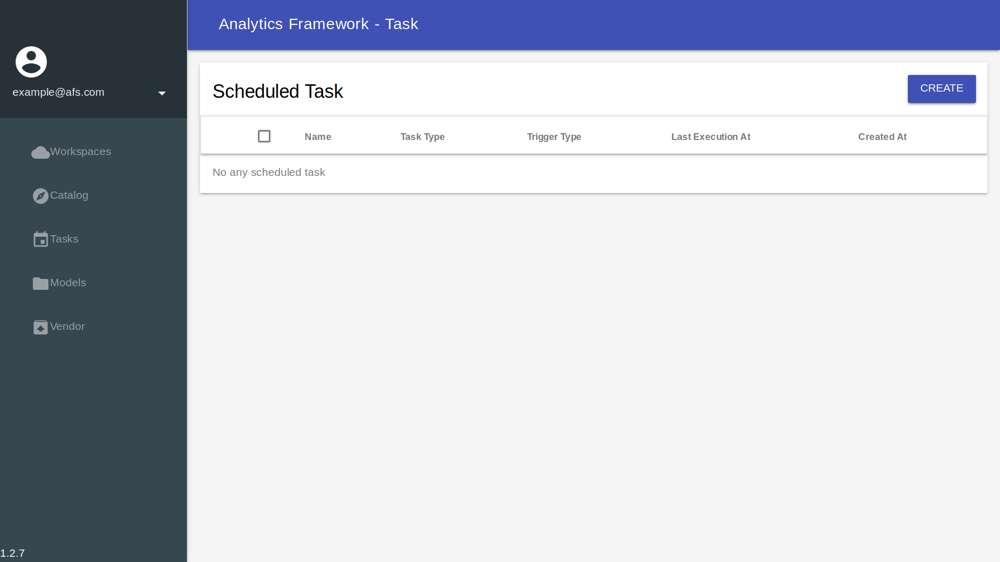

### Create new task

Step 1 : Click **Tasks**

Step 2 : Click **CREATE**

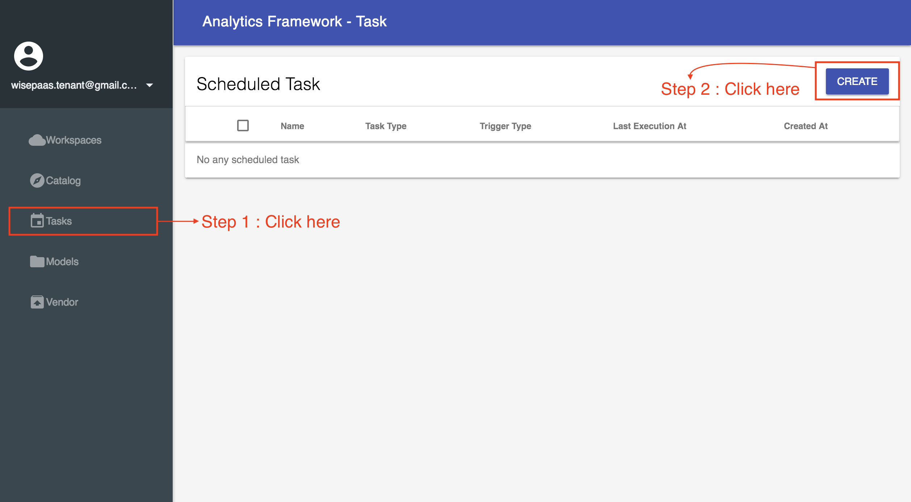

Step 3 : Enter task name

Step 4 : Click **NEXT**

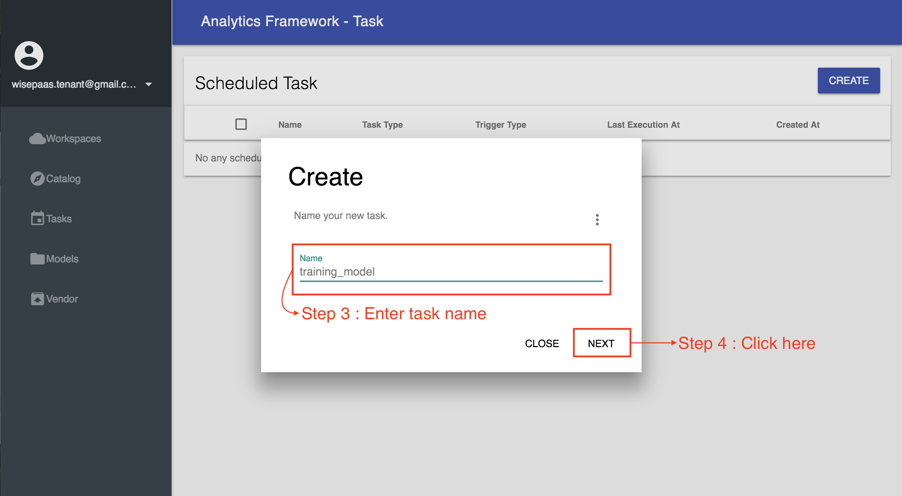

#### Task types

Step 5 : Choose **Task Type**(click Solution)

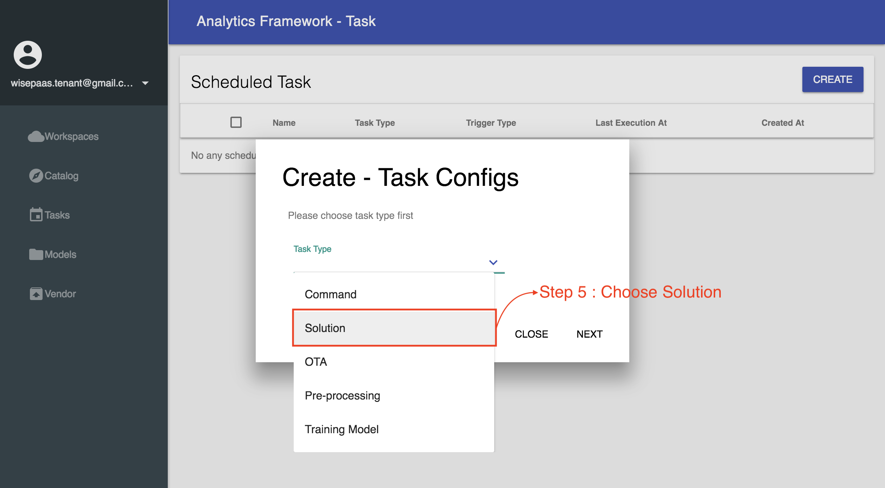

Step 6 : Choose **Solution Instance**(You can choose which you create solution , and you can refer https://afs-docs.readthedocs.io/en/latest/portal/workspace.html#solution to create your solution )

Step 7 : Click **NEXT**

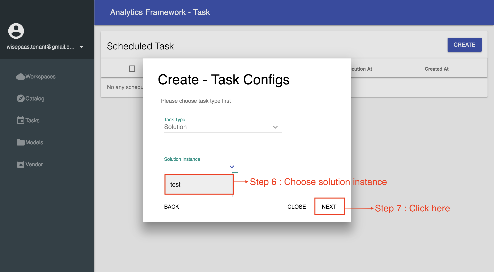

#### Trigger types

Step 8 : Choose **trigger type**(In this example ,we choose **interval**)

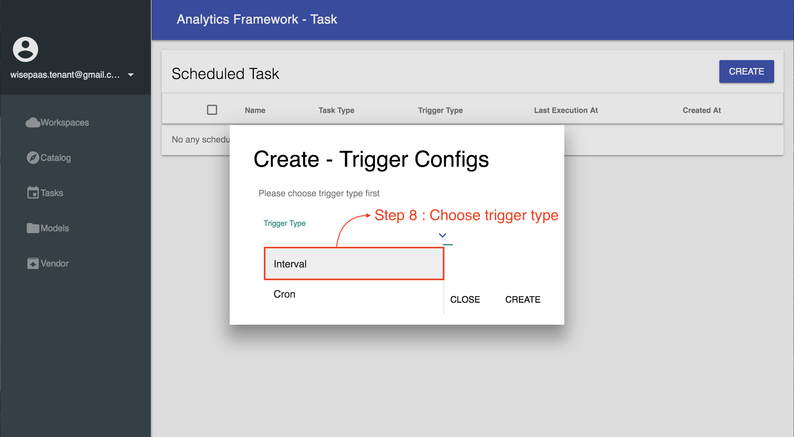

Step 9 : Choose **interval type**(In this example ,we choose **Minutes**)

Step 10 : Enter **interval**(In this example ,we enter **1**)

Step 11 : Click **CREATE**

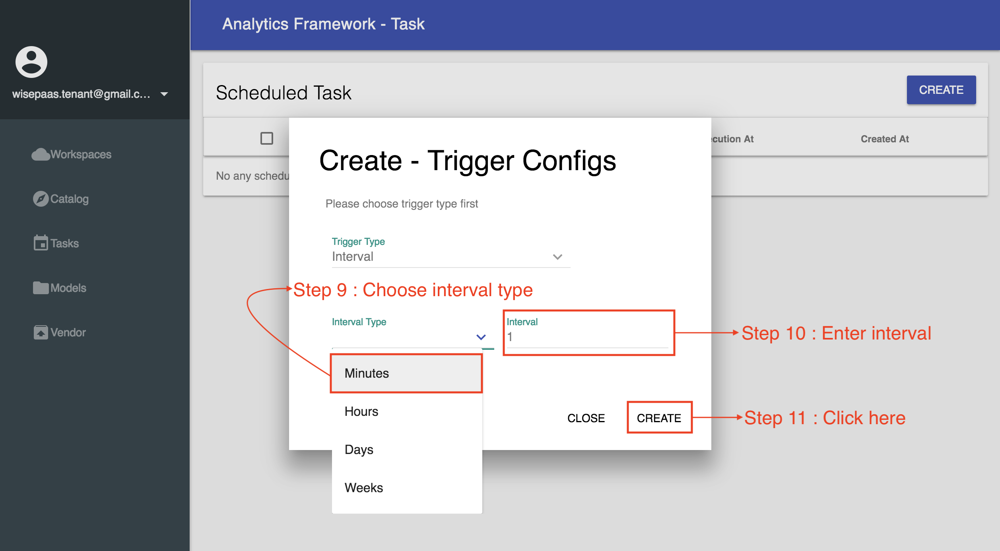

Step 12 : Click training model

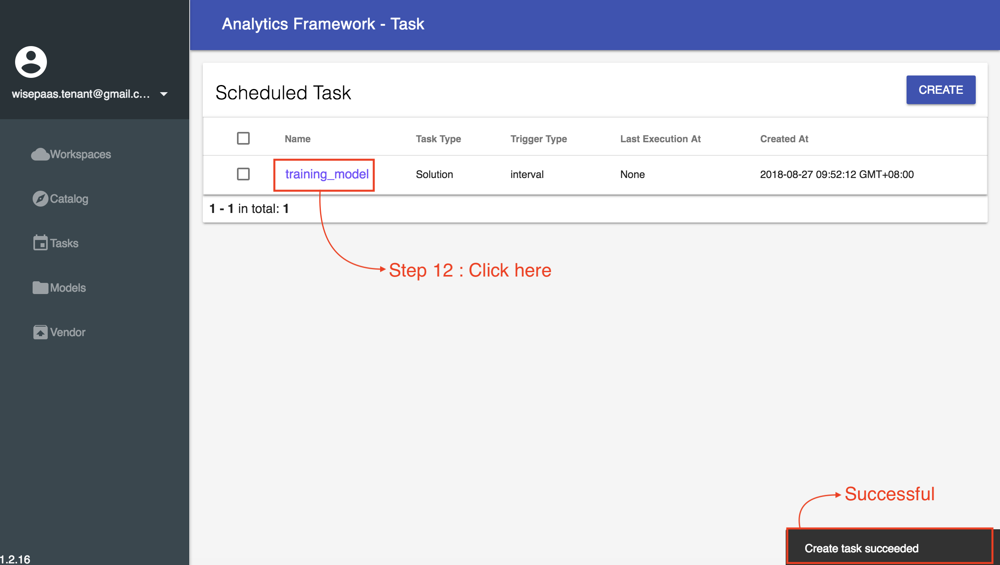

When you click training model , and you can see like this

When the task successed , you can see like this

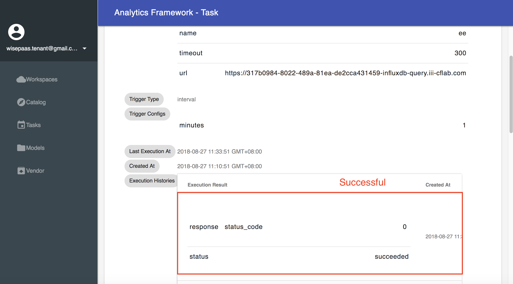

* If timeout occurs, please adjust the interval size because the training time is greater than interval

### Task detail

#### Pause task
Step 1 : Click **PAUSE**

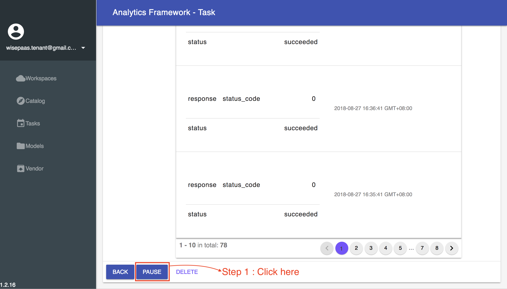

#### Resume task

Step 1 : Click **RESUME**(You need click **PAUSE** first , and *RESUME** 
will appear)

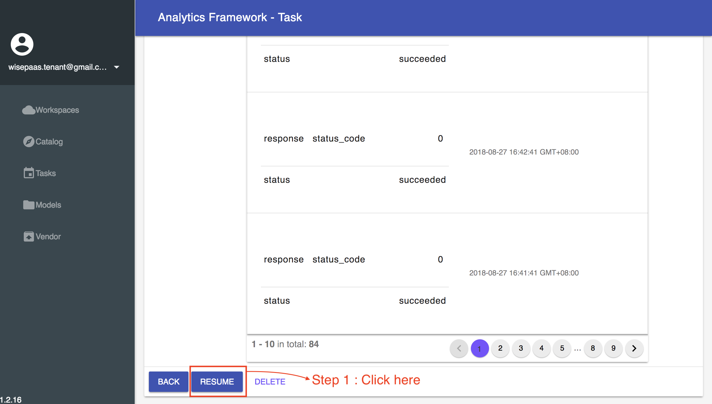

### Delete task

Step 1 : Click **DELETE**

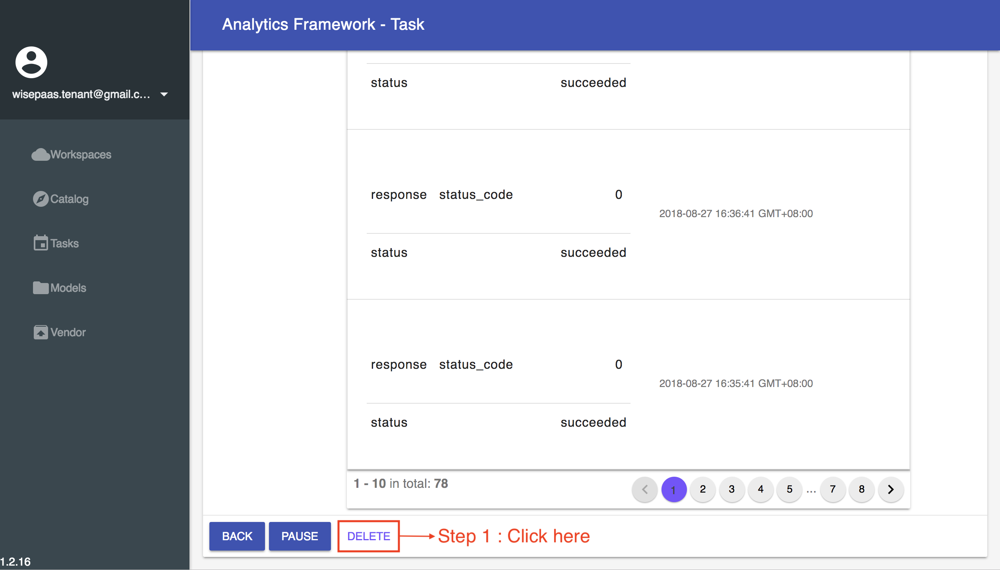

