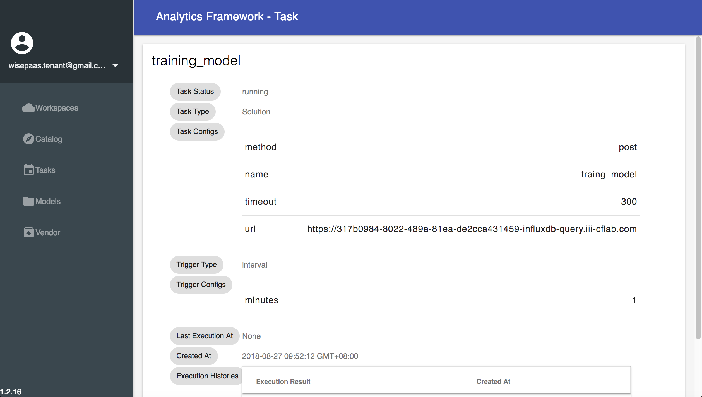
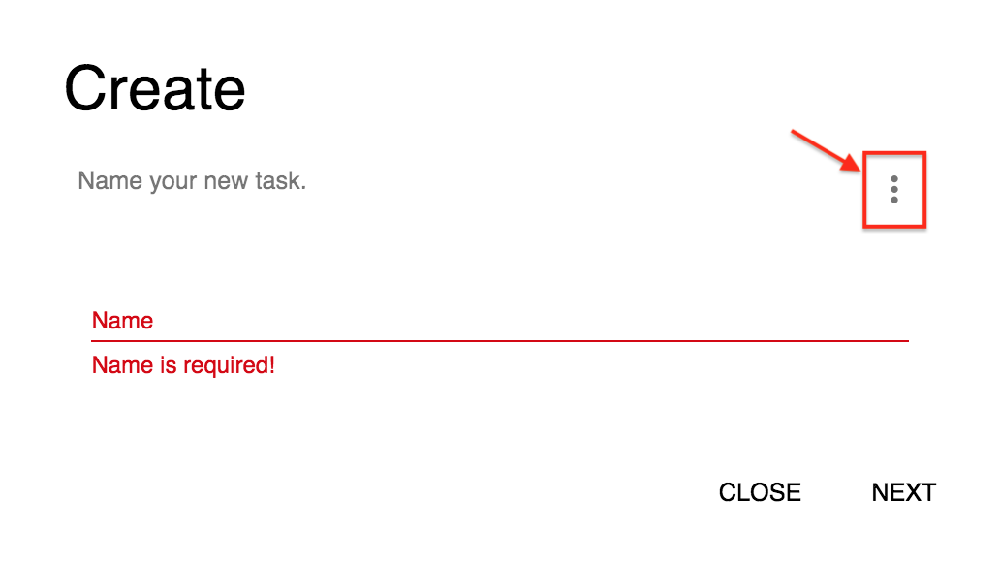
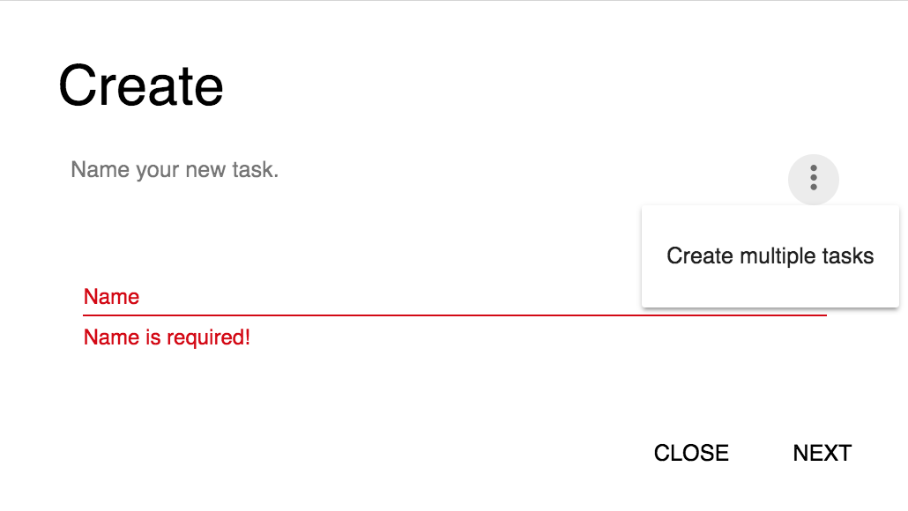

## Tasks

### Create new task

**Step 1 :** Click **Tasks**

**Step 2 :** Click **CREATE**

**Step 3 :** Enter task name

**Step 4 :** Click **NEXT**

#### Task types

**Step 5 :** Choose **Task Type**(click Solution)

**Step 6 :** Choose **Solution Instance**(You can choose which you create solution , and you can refer [Solution](https://afs-docs.readthedocs.io/en/latest/portal/workspace.html) to create your solution )

**Step 7 :** Click **NEXT**

#### Trigger types

**Step 8 :** Choose **trigger type**(In this example ,we choose **interval**)

**Step 9 :** Choose **interval type**(In this example ,we choose **Minutes**)

**Step 10 :** Enter **interval**(In this example ,we enter **1**)

**Step 11 :** Click **CREATE**

**Step 12 :** Click training model

When you click training model , and you can see like this

When the task successed , you can see like this

* If timeout occurs, please adjust the interval size because the training time is greater than interval ; **API** can only accept one request at a time, receiving multiple requests at a time will timeout

### Task detail

#### Pause task
**Step 1 :** Click **PAUSE**

#### Resume task

**Step 1 :** Click **RESUME**(You need click **PAUSE** first , and *RESUME** 
will appear)

### Delete task

**Step 1 :** Click **DELETE**

### Create multiple tasks

**Step 1 :** Click **Tasks**

**Step 2 :** Click **CREATE**

**Step 3 :** Click here

**Step 4 :** Click **Creare multiple task**

**Step 5 :** Click **csv example** to download csv example

**Step 6 :** Choose csv file ([example](https://github.com/chenjr0719/AFS-docs/blob/master/docs/_static/images/portal/tasks/multiple_task_example.csv), in this example , you must create APP first that you refer [Analytics](https://afs-docs.readthedocs.io/en/latest/portal/workspace.html#analytics))

* In this example , the parameter of **cron** that refer this [link](http://www.adminschoice.com/crontab-quick-reference) 

**Step 7 :** Click **CREATE**

**Successful**

