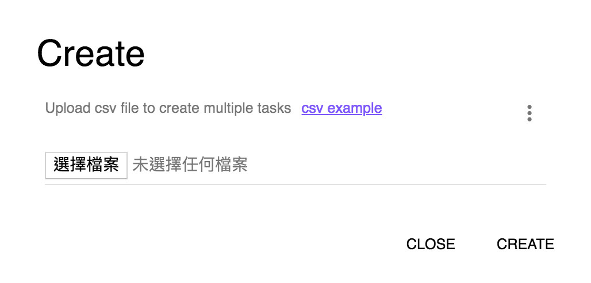

## Tasks
 	

### Create new task

**Step 1:** Click **Tasks**.

**Step 2:** Click **CREATE**.

**Step 3:** Enter task name training_model.

**Step 4:** Click **NEXT**.

#### Task types

**Step 5:** Choose **Task Type**, then choose Solution.

**Step 6:** Choose **Solution Instance**. (You can choose which you create solution, please refer [Solution](https://afs-docs.readthedocs.io/en/latest/portal/workspace.html) to create your solution.)

**Step 7:** Click **NEXT**.

#### Trigger types

**Step 8:** Choose **trigger type**. 

In this example, we choose **Interval**.

**Step 9:** Choose **Interval type**.

In this example, we choose **Minutes**.

**Step 10:** Enter **Interval**.

In this example, we enter **1**.

**Step 11:** Click **CREATE**.

**Step 12:** Click training model.

When the task has been executed, you can see like this.

* If timeout occurs, please adjust the interval size because the training time is greater than interval; **API** can only accept one request at a time, receiving multiple requests at a time will timeout.

### More Task's Operations

The users can operate the tasks by the requirement. There are three operations which are provided, include `PAUSE`, `RESUME`, and `DELETE`.

### Create multiple tasks

**Step 1:** Click **Tasks**.

**Step 2:** Click **CREATE**.

**Step 3:** Click icon as follows.

**Step 4:** Click **Create multiple task**.

**Step 5:** Click **csv example** to download csv example.

**Step 6:** Choose csv file. (In the [example](https://github.com/chenjr0719/AFS-docs/blob/master/docs/_static/images/portal/tasks/multiple_task_example.csv), you must create APP first. Please refer [Analytics](https://afs-docs.readthedocs.io/en/latest/portal/workspace.html#analytics)).

* In the example, the parameter of **Cron** that refer the [link](http://www.adminschoice.com/crontab-quick-reference). 

**Step 7:** Click **CREATE**, and the tasks are created successfully.

