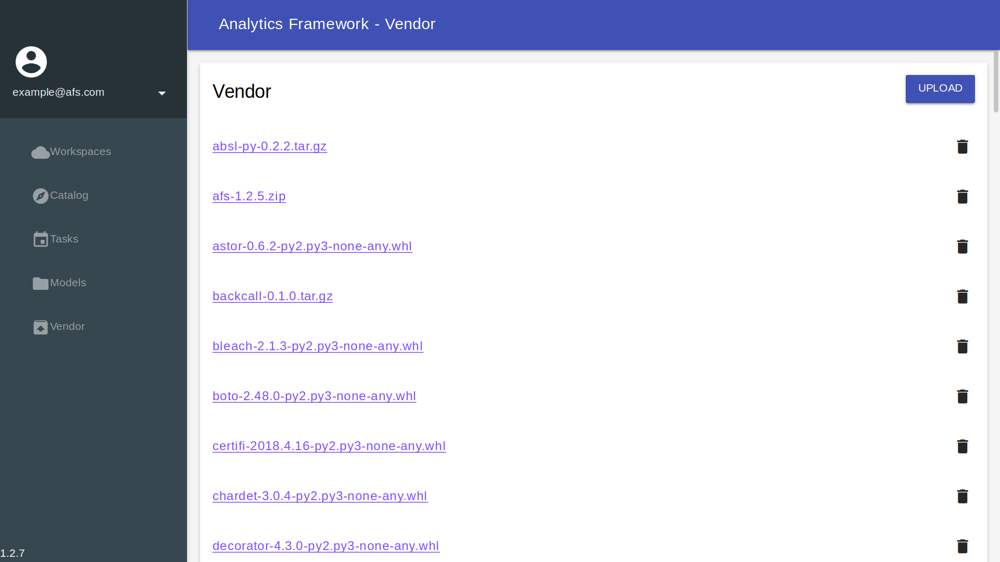

## Vendor

The **vendor** provides modules support for private cloud version of AFS. This chapter will illustrate how to:

1. Download required module from [PyPI](https://pypi.org/)
2. Upload module to vendor
3. Install modules in Online Code IDE

### Get started

The default screen of vendor will lookk like:

#### Download required module from [PyPI](https://pypi.org/)

#### Upload new module

#### Install modules in Online Code IDE

