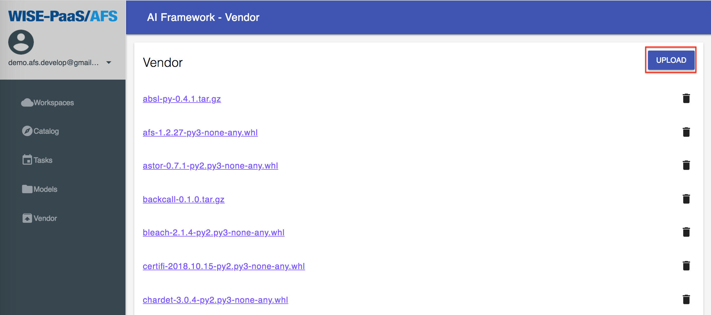
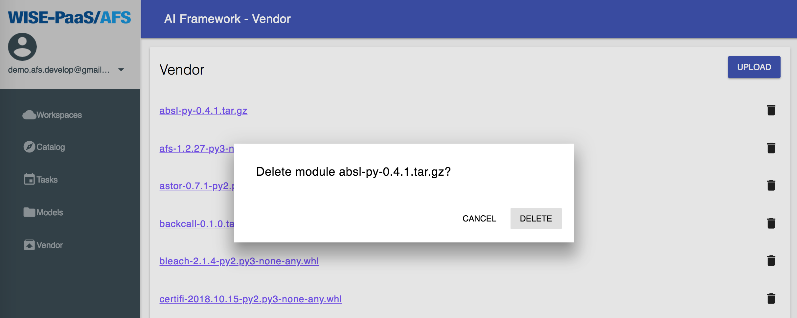

## Vendor

The **vendor** provides modules support for private cloud version of AFS. This chapter will illustrate how to:

1. Download required module from [PyPI](https://pypi.org/)

2. Upload module to vendor

3. Delete module in vendor


### Download required module from [PyPI](https://pypi.org/)

All analytic app in AFS will use **Python 3.6.x** on **Linux** as default runtime. If you want to add a new module to vendor, please make sure version compatible of module.

Python modules will follow [PEP 427](https://www.python.org/dev/peps/pep-0427/#file-format) to provide **wheel**, **tar.gz**, or **zip** as distribution file. So we can follow this specification to find the compatible module and use it with **vendor**.

Here is an example for download a module **scikit-learn**:

1. Search the module on [PyPI](https://pypi.org/).
    

2. Find the correct project page.
    

3. Switch to **Download files** page.
    

4. Choose compatible version and download.
    

The name of wheel file looks like:
```
scikit_learn-0.19.1-cp36-cp36m-manylinux1_x86_64.whl
```
According to [PEP 427](https://www.python.org/dev/peps/pep-0427/#file-format), **cp36** means it is for Python(more specifically, it's [CPython](https://en.wikipedia.org/wiki/CPython)) **3.6.x**, **manylinux1** means it is for **Linux** platform, and **x86_64** means it is for **64bit architecture**.

Another example is **requests**:

1. Search the module on [PyPI](https://pypi.org/).
    

2. Find the correct project page.
    

3. Switch to **Download files** page and download.
    

In this example, the name of wheel is:
```
requests-2.19.1-py2.py3-none-any.whl
```
If the file name looks like this, it means this wheel can be used for both **Python 2.x** and **Python 3.x** on **any** platform.


### Upload module to vendor

After download module file, you can upload it to AFS vendor and let all analytic app to use this module in Online Code IDE.

1. Press **upload** button
    

2. Select file which downloaded at first step.
    

3. Check the module.
    


### Delete module in vendor

You can also delete modules in vendor with following steps:

1. Click trash icon right behind the module name.
    

2. Portal will ask to confirm delete, click **delete** button.
    

