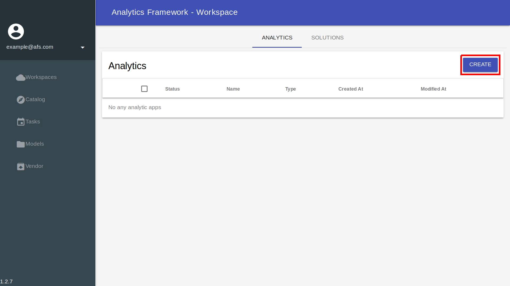
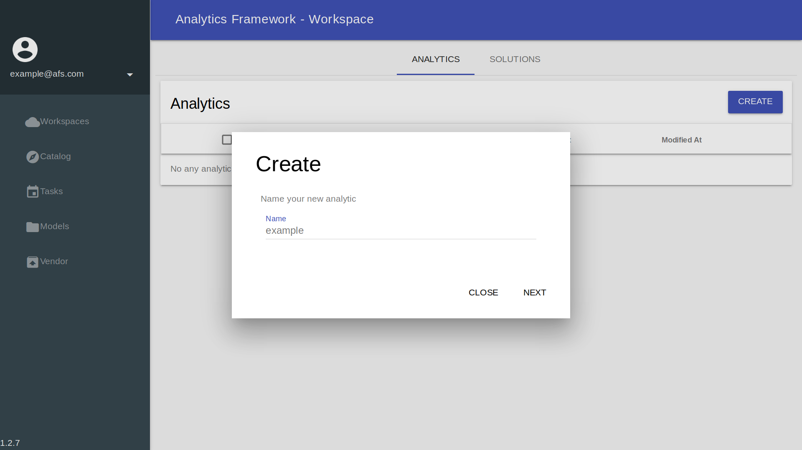
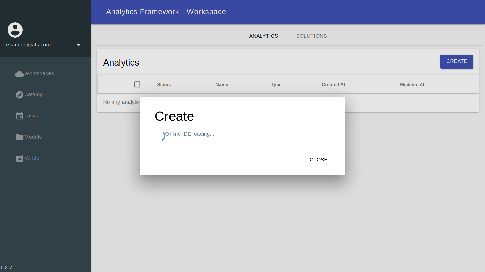
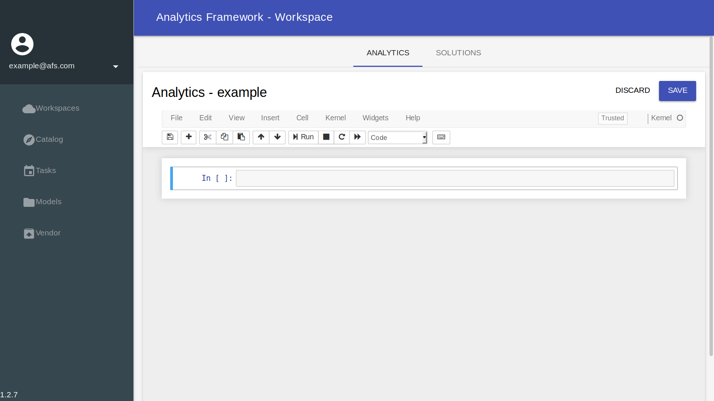
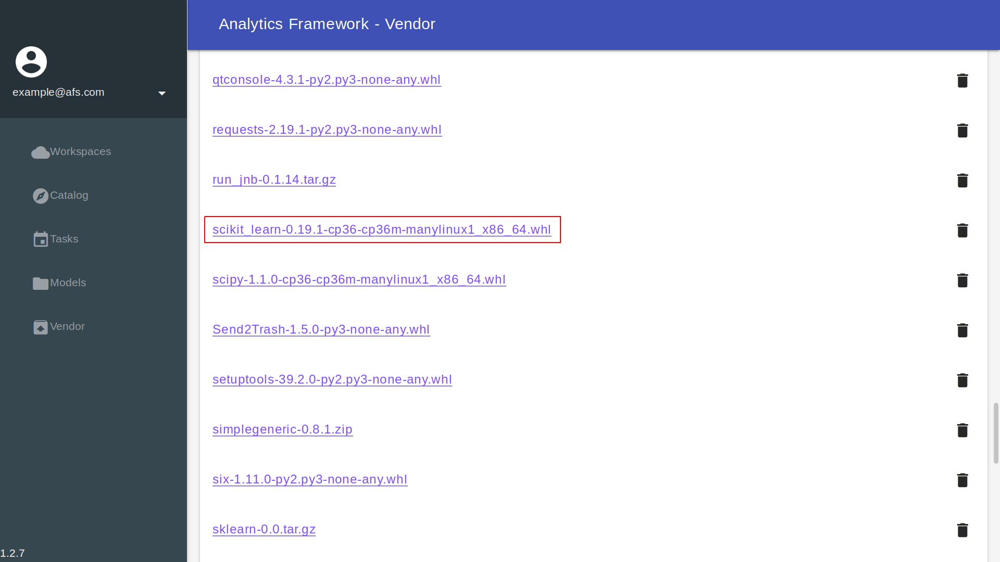
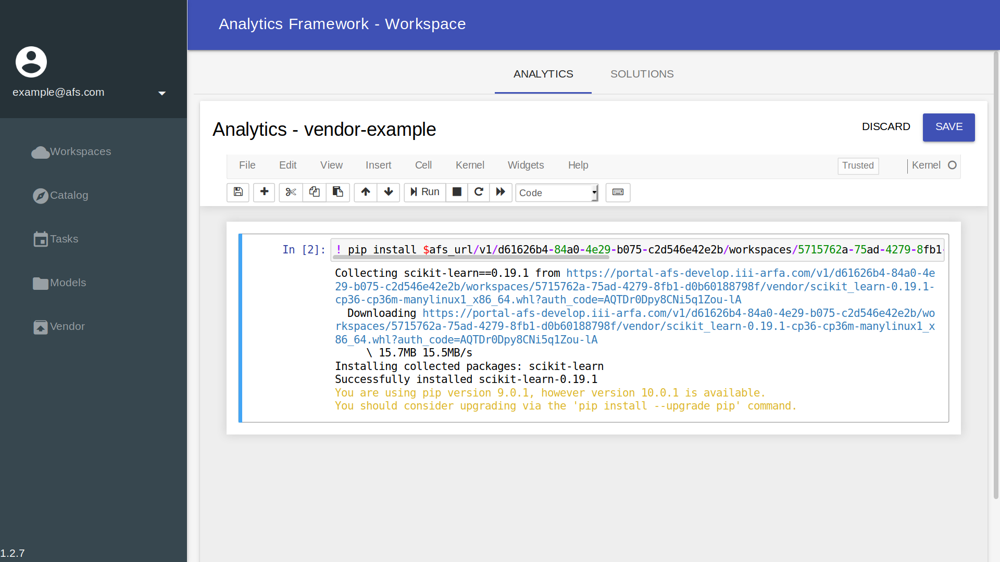

## Workspace


### Analytics


#### Online Code IDE

In **AFS**, we provide a powerful **Online Code IDE** based on [Jupyter](http://jupyter.org/) to develop your analytic on the cloud with complete **EnSaaS** .


##### auth_code

The `$auth_code` is an environment variable from **Online Code IDE**, and the purpose of `$auth_code` is authenticating with **AFS** to use **AFS** functions in programs.

To check `$auth_code` of **Online Code IDE**, you can use the following snippet:
```
import os
auth_code = os.getenv('auth_code')
print(auth_code)
```
The output:


#### Create analytic with Online Code IDE







#### Install module with [Vendor](vendor.html) in private cloud

In python develop, we can use `pip install $MODULE` to install all required module. But in a private cloud, there is no any external internet resource can be used, including [PyPI](https://pypi.org/).

This restrict force all required modules should provide an offline distribution file in the private cloud when developing in **Online Code IDE** and save the source code to an analytic app.

This section will provide an example to use **Vendor** of AFS to install a module in  **Online Code IDE**. Assume the module is already uploaded to **AFS**, if not, please reference documentation of [Vendor](vendor.html) to upload module.

1. Right-click on the module and copy the url.
    

2. In **Online Code IDE**, use the following command and paste copied module url to install modules from the vendor:
    ```
    ! pip install $MODULE_URL?auth_code=$auth_code
    ```
    


### Solutions


#### Create new solution