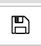
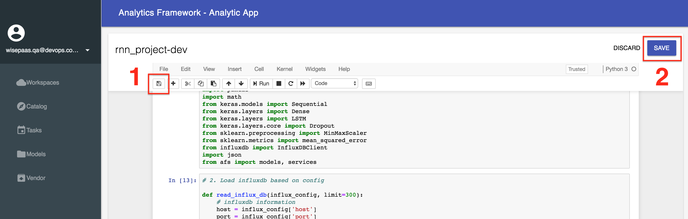
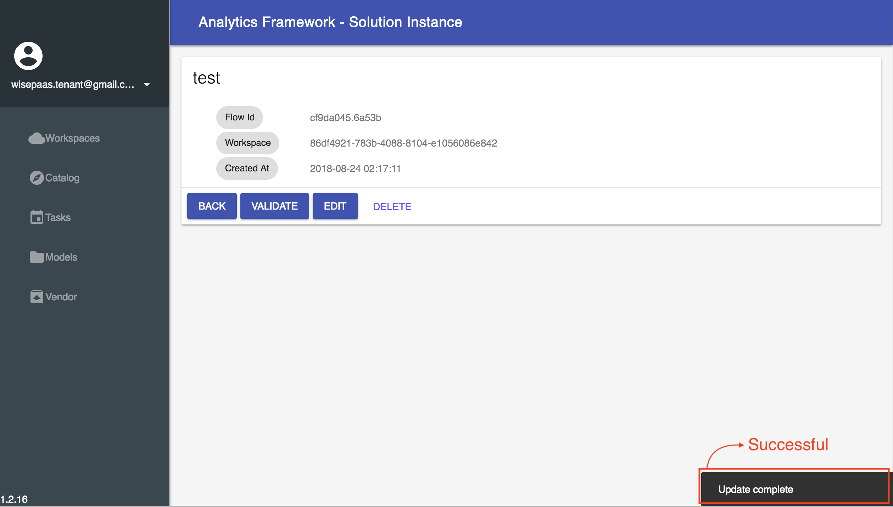

## Workspace


### Analytics


#### Online Code IDE

In **AFS**, we provide a powerful **Online Code IDE** based on [Jupyter](http://jupyter.org/) to develop your analytic on the cloud.


#### auth_code

The `$auth_code` is an environment variable from **Online Code IDE**, and the purpose of `$auth_code` is authenticating with **AFS** to use **AFS** functions in your analytics.

To check `$auth_code` of **Online Code IDE**, you can use the following snippet:
```
import os
auth_code = os.getenv('auth_code')
print(auth_code)
```
The output:


#### Manifest

In **Online Code IDE**, you can define some customize configurations like **memory**, **disk**, or **requirements** for your analytic by declaring a **manifest** at the first cell.

Here is an basic example:
```python
manifest = {
    'memory': 2048,
    'disk_quota': '2048MB',
    'requirements': [
        'pandas'
    ],
    'type': 'API'
}
```


In this example, **memory** and **disk_quota** are also assigned to 2048MB. If set **memory** or **disk_quota** as **int** type, the default unit is **MB**. Or, use **str** type and you can specify the unit in **M**, **MB**, **G**, or **GB**.

> **Note:** The default value of **disk_quota** is **2048MB** to avoid insufficient disk space when installing modules. If you set **disk_quota** less than 2048MB, the value will be overridden to 2048MB.

The **requirements** are the most important part in analytic develop. As native python develop, when you need some external modules, you can use **requirements.txt** to record all dependencies of your analytic. (more information can be found at [pip docs](https://pip.pypa.io/en/stable/user_guide/#id1)). Provide a list of **requirements** can obtain the same effect when developing analytic by **AFS**.

The **Type** is used to declare this analytic is an **APP** or an **API**. In default, all analytic will be assigned as **APP** type. But if you want your analytic serve as an **API**(and also write in any web framework), you need set **type** to **API** to host your analytic on **WISE-PaaS**.


#### Create analytic with Online Code IDE

1. Click the `CREATE` buttom.
    

2. Enter the custom name of the analysis module, and press NEXT to confirm.
    

    

3. When the newly established development & editing page appears in the workspace, it means the module has been successfully created and you can write the analysis module using Python programming language.
    

4. After filling in the program code, you can click the icon  to save it. Next, click `SAVE` button to push analysis training model application to the platform in the form of an App. This APP will show in Workspace list when completely deployed.
    

#### Install module with [Vendor](vendor.html) in private cloud

In python develop, we can use `pip install $MODULE` to install all required module. But in a private cloud, there is no any external internet resource can be used, including [PyPI](https://pypi.org/).

This restrict force all required modules should provide an offline distribution file in the private cloud when developing in **Online Code IDE** and save the source code to an analytic app.

This section will provide an example to use **Vendor** of AFS to install a module in  **Online Code IDE**. Assume the module is already uploaded to **AFS**, if not, please reference documentation of [Vendor](vendor.html) to upload module.

1. Right-click on the module and copy the url.
    

2. In **Online Code IDE**, use the following command and paste copied module url to install modules from the vendor:
    ```bash
    ! pip install $MODULE_URL?auth_code=$auth_code
    ```
    


#### Here is an example of **Decision Tree**
#### Step1: Create a new Online Code IDE 

Refer detail to the **Create analytic with Online Code IDE** above.

#### Step2: Manifest
Declaring a **manifest** at the first cell.
Refer detail to the **Manifest** above.

```python =
manifest = {
    'memory': 1024,
    'disk_quota': 2048,
    'buildpack': 'python_buildpack',
    'requirements': [
        'numpy',
        'pandas',
        'scikit-learn',
        'influxdb',
        'requests',
        'scipy',
        'urllib3',
        'afs'
    ],
    'type': 'API'
}
```


#### Setting parameter 
In **Online Code IDE**, you can create a node on **Node-RED** by **SDK**, and you can provide the **Hyper-Parameter Tuning** for user. The following code must be at **second cell**.

```python =
from afs import config_handler
cfg = config_handler()
cfg.set_param('criterion', type='string', required=True, default="gini")
cfg.set_param('random_state', type='string', required=True, default="2")
cfg.set_param('max_depth', type='string', required=True, default="3")
cfg.set_param('K_fold', type='integer', required=True, default=10)

cfg.set_param('model_name', type='string', required=True, default="dt_model.pkl")
cfg.set_features(True)
cfg.set_column('data')
cfg.summary()

```
* Note: If you finish your code in this cell, you must run it.

Describe the features that the SDK can produce, here is an example of **Decision Tree**.


#### Training model
Here is an example of **Decision Tree**:
import package:
```python =
from sklearn import tree
from sklearn.cross_validation import train_test_split
from sklearn import metrics
from sklearn.externals import joblib
from afs import models
from sklearn.preprocessing import StandardScaler
from sklearn.preprocessing import LabelBinarizer
from sklearn.preprocessing import OneHotEncoder
from sklearn.model_selection import cross_val_score
from sklearn.model_selection import GridSearchCV

import pandas as pd
import numpy as np
import json
import requests
```

Defined function:
```python =
#Find the best parameter to training model
def grid(data, target, parameters_dt, cv):
    clf = tree.DecisionTreeClassifier()
    grid = GridSearchCV(estimator = clf, param_grid = parameters_dt, cv = cv, 
                        scoring = 'accuracy')
    grid.fit(data,target)
    best_accuracy = grid.best_score_
    best_params = grid.best_params_
    return best_accuracy,best_params
```

```python =
#Take the best parameter to training model
def training_model(data, target,best_params, best_accuracy,model_name):
    clf = tree.DecisionTreeClassifier(**best_params)
    clf = clf.fit(data, target)
    #save model
    joblib.dump(clf, model_name)
    client = models()
    client.upload_model(model_name, accuracy=best_accuracy, loss=0.0, tags=dict(machine='dt'))

    return model_name
```

Main program:
```python =
# POST /

# Set flow architecture, REQUEST is the request including body and headers from client
cfg.set_kernel_gateway(REQUEST)
# Get the parameter from Node-RED setting

criterion = str(cfg.get_param('criterion'))
random_state = str(cfg.get_param('random_state'))
max_depth = str(cfg.get_param('max_depth'))
cv = cfg.get_param('K_fold')


model_name = str(cfg.get_param('model_name'))
select_feature = cfg.get_features_selected()
data_column_name = cfg.get_features_numerical()
target2 = cfg.get_features_target()

labels_column_name = [x for x in select_feature if x not in data_column_name]
labels_column_name = [x for x in labels_column_name if x not in target2]

if(labels_column_name==[]):
    labels_column_name=["No"]

a1=["time"]
labels_column_name = [x for x in labels_column_name if x not in a1]

if "All" in labels_column_name:
    labels_column_name.remove("All")

if(data_column_name==[]):
    data_column_name=["No"]

criterion = criterion.split(",")
random_state = random_state.split(",")
max_depth = max_depth.split(",")

random_state =list(map(int, random_state))
max_depth = list(map(int, max_depth))

parameters_dt = {"criterion": criterion, "random_state": random_state, "max_depth": max_depth}


# Get the data from request, and transform to DataFrame Type
df = cfg.get_data()
df = pd.DataFrame(df)

target = np.array(df.loc[:,[target2]])

if (data_column_name[0]=="All"):
    all_df_column = [df.columns[i] for i in range(len(df.columns))]
    if (labels_column_name[0]!="No"):
        for i in range(len(labels_column_name)):
            all_df_column.remove(labels_column_name[i])
        all_df_column.remove(target2)
    if (labels_column_name[0]=="No"):
        all_df_column.remove(target2)
    data = np.array(df.loc[:,all_df_column])

elif (data_column_name[0]=="No"):
    data = np.array([]).reshape(df.shape[0],0)
    if (labels_column_name[0]!="No"):
        for i in labels_column_name:   
            if ((False in map((lambda x: type(x) == str), df[i]))==False):
                label2 = LabelBinarizer().fit_transform(df[i])
                data = np.hstack((data,label2))
            if ((False in map((lambda x: type(x) == int), df[i]))==False):
                target9 = OneHotEncoder( sparse=False ).fit_transform(df[i].values.reshape(-1,1))
                data = np.hstack((data,target9))

else:    
    data = np.array(df.loc[:,data_column_name])
    if (labels_column_name[0]!="No"):
        for i in labels_column_name:   
            if ((False in map((lambda x: type(x) == str), df[i]))==False):
                label2 = LabelBinarizer().fit_transform(df[i])
                data = np.hstack((data,label2))
            if ((False in map((lambda x: type(x) == int), df[i]))==False):
                target9 = OneHotEncoder( sparse=False ).fit_transform(df[i].values.reshape(-1,1))
                data = np.hstack((data,target9))

best_accuracy,best_params = grid(data, target, parameters_dt, cv)
result = training_model(data, target,best_params, best_accuracy,model_name)
result = str(result)

df2 = pd.DataFrame([result], columns=['model_name'])
# df_dict = df2.to_dict()  


# # Send the result to next node, and result is  DataFrame Type

ret = cfg.next_node(df2, debug=False) 

# # The printing is the API response.
print(json.dumps(ret))

```


#### Save and upload the Analytic App
After we edit the Analytic App, we must save and upload it as follow steps:

**Step 1.:**
Click the icon  is in upper left corner.

**Step 2.:**
Click `SAVE`, and we are uploading the Analytic App now.


After a second, we can see that it's successful to upload.


### Solution
**Pre-condition**
Before creating a solution, there are preparation we msut get ready.
In the beginning, subscribing ota node and firehose node form Catalog is required.

Now, we subscribe the ota node firstly.

**Step 1.:** Click **Catalog**. 

**Step 2.:** Click ota's **DETAIL**.


**Step 3.:** Click **SUBSCRIBE**, and we subscribe the ota node successfully.

Here we subscribe the firehose node.
**Step 4.:** Click **Catalog**.


**Step 5.:** Click firehose's **DETAIL**.


**Step 6.:** Click **SUBSCRIBE**, and we subscribe the firehose node successfully.

**Step 7.:** Click **Workspace**, go back to workspace.


Now, we can see the new Analytic APIs are creating.


The Analytic APIs are created successfully.


### Creating a new solution

**Step 1.:** Click **Workspaces**.

**Step 2.:** Click **SOLUTIONS**.

**Step 3.:** Click **CREATE**.


**Step 4.:** Enter the filename.

**Step 5.:** Click **CREATE** to create the solution.


**Step 6.:** Click **EDIT**.


Now, we can see the Node-RED UI, and start to create the flow.


### Start training model
In **Pre-condition** step, we create ota node and firehose node. Decision Tree example in the above, we create a Decision Tree node, sso_setting already exists. 

Now, we have **sso_setting** node, **firehose_influxdb_query** node, **training_dt_model** node, and **ota** node.

You need pull four nodes such that **sso_setting**, **firehose_influxdb_query**, **training_dt_model**, and **ota**.

Here is a example like this:


**Setting the nodes**
1. The **sso_setting** node

**Step 1.:** Enter **SSO User** and **SSO Password**.

**Step 2.:** If you complete the setup, please click **DONE** to save your setting.


2. The **firehose_influxdb_query** node

**Step 1.:** Choose **Service Name**, **Service Key**, and enter **Query** condition.

**Step 2.:** If you complete the setup, please click **DONE** to save your setting.


3. The **training_dt_model** node

**Step 1.:** Enter **parameters** to training model.


 
**Step 2.:** Select **features** to training model.

**Step 3.:** Select **numerical data**.


**Step 4.:** Select **target** to training model.

**Step 5.:** If you complete the setup, please click **DONE** to save your setting.


4. The **ota** node

**Step 1.:** Choose **Device Name** and **Storage Name**.

**Step 2.:** If you complete the setup, please click **DONE** to save your setting.


**Nodes connecting**

**Step 1.:** Connect nodes.

**Step 2.:** Click **Deploy** to save **Node-RED**.

**Step 3.:** Click **SAVE** to save solution.


**Successful**


