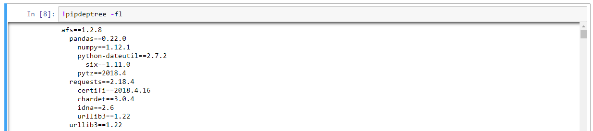

# Install AFS-SDK without external network
If you want install AFS-SDK without external network, you should install dependency step by step. The following is afs-sdk dependency tree:

## Check out the dependency tree command 
```
! pip install pipdeptree
! pipdeptree -fl
```




## AFS-SDK dependency tree
Install dependency package first.
```
* afs==1.2.8
  *  pandas
  *  numpy
  *  python-dateutil
      * six
      * pytz
  * requests
    * certifi
    * chardet
    * idna
    * urllib3
```


## Build AFS-SDK whl  
To build the wheel package:
```
$ python setup.py bdist_wheel
```

AFS-SDK whl file will be in dist/ directory.
