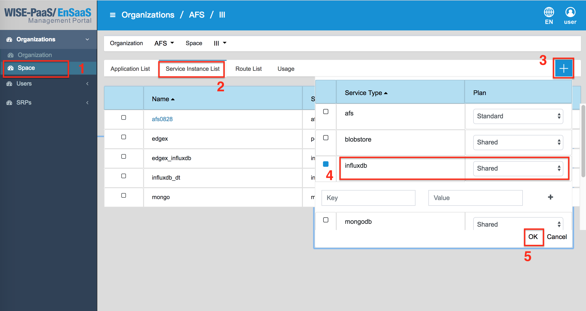

# Troubleshooting
In the section, we provide some problems that users may encounter, and the solutions for reference.

## Jupyter Kernel Die

1. Memory GC issue
	There are 2GB memory for each Jupyter notebook. It may occur the kernel restart when use too more memory. The example for releasing the memory is as follows.   
	Before: When the API is called, it will occupy 512MB of memory.
	* GET /test
	```
	memory_str = ' ' * 512000000 * 1
	print("OK")
	```
	After: When the result is returne, the variables are deleted, and the memory will be released.
	* GET /test
	```
	memory_str = ' ' * 512000000 * 1
	del memory_str
	print("OK")
	```

2. Disk full issue
	There are 2GB disk space for each Jupyter notebook, and there are about 1.2GB used for installing the Jupyter and related packages. 

3. Dependency packages
	There are some dependency packages of Jupyter. They cause the kernel error when they have bug occasionally.   
	* ipykernel
	* ipython
	* jupyter_client
	* jupyter_core
	* traitlets
	* ipython_genutils

---

## Task Failed

The analytics and solutions can be scduled to execute automatically by **Tasks**. About the operations are introduced in the [Tasks](https://afs-docs.readthedocs.io/en/latest/portal/tasks.html). However, there is limitation when the task works, and it's described in the section.    
The troubleshooting of task failed is introduced. When the problem occurs, we can check the log in the analytics. The example and steps are as follows: Please click the **Workspaces**, and click the analytic which want to check. Then, we can see the `LOGS` button, and click it. The logs are shown in the diagram. The message shows "WORKER TIMEOUT" that why the task failed. User can restart the app in the Management Portal, and create a new task for the analytic.



---
## Other Issue
* When uploading the file which is less than 2GB, but the error occured, the error message: "StorageDataError: BotoClientError: Out of space for destination file."
	* **Root cause:** Checking the Jupyter in afs service instance and find that the disk is almost full, already used about 1.9GB. It causes an exception message when the Boto client is used to get file from the Blob store.
	* **Solution:** When subscribing the AFS service instance after version 1.2.26, the Jupyter and Node-RED would be deployed to the current AFS Instance. Users can use the CF CLI to obtain the current usage of the disk. (Management Portal only displays the size of the App, but can't display usage). If there is not enough space, the users can delete the application or restart the app by the CLI command.   
    
	There are the commands to check the disk quota:
	- Check the disk quota that the current APP are used: 
		```cf app APP_NAME```
	- Login to the APP: 
		```cf ssh APP_NAME```
	- Restart the App: 
		```cf restart APP_NAME```

---


